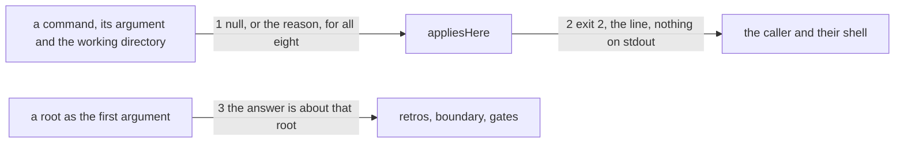

# Drawing: nothing-passes-vacuously

_Written in architect mode from `requirements/nothing-passes-vacuously`,
three criteria and three red tests. The closed requirements and their
tests were read first. `applies-here` is the task this supersedes in part,
and its shape is otherwise untouched: the table stays one table, asked
once, before anything is read, and the reason keeps its line, its stream
and its exit code. `code-v2` keeps `fixtures` out of the table, and
`witness-a-tree` added a second guarded place to the boundary wall four
hours ago, which is why the entry below asks that wall's own list rather
than naming a directory. The human approves by merge._

## Structure

What exists: `bin/lib/applies.mjs`, one table of four commands, asked once
in `bin/kaal.mjs` before any branch runs; `bin/lib/boundary.mjs`, which
exports `PLACES`, the guarded places and their sinks; the four branches
that read the working directory.

What changes:

- **`bin/lib/applies.mjs`**: four more entries, and `GUARDED` becomes
  eight. `retros` and `runner` look for a skills tree, `boundary` asks the
  wall's own list of places, `gates` looks for the config it reads.
- **`bin/kaal.mjs`**: `retros`, `boundary` and `gates` answer about
  `arg ?? cwd` rather than about `cwd`. `runner` is untouched.
- **`tests/applies.test.mjs`**: three of its tests move, because the
  requirement supersedes that part of `applies-here` on purpose. The list
  of guarded commands becomes eight; the list of commands the table does
  not name keeps `fixtures`, `assess` and a command it has never heard of;
  and the sweep that hands every entry a foreign path stops expecting
  `runner` to refuse one, since `runner` is asked about the working
  directory and its argument is a skill.

Nothing is new, and no command changes what it does once it has decided
the question is this tree's.

## Seams

1. **null, or the reason, for all eight**: in, a command name, the
   argument it was given and the working directory; out, null when the
   artefact it reads is there, or the reason it is not. The contract drives
   all eight guarded commands, not only the four that are new, because the
   promise worth holding is that the table grew and did not move: a
   foreign tree refuses all eight, the league answers all eight, and a root
   holding only a `kaal.config.json` answers `gates` alone.
2. **exit 2, the line, nothing on stdout**: in, a reason; out, exit 2, one
   line on stderr of the shape `<command>: not applicable here: <what it
looked for>`, and nothing at all on stdout, for each of the four new
   commands. The contract also holds the one case a table like this gets
   wrong: `kaal runner analyse json-flag` in a foreign tree names that
   tree, never a directory called `analyse`, because a skill name is not a
   path.
3. **the answer is about that root**: in, a root as the first argument to
   `retros`, `boundary` or `gates`; out, the answer for that root and not
   for the working directory, driven from inside the league so the two
   cannot be confused. `runner` keeps its positional arguments and is
   asked about the working directory.

## Fixed and free

- Fixed: the line's shape, its stream, exit 2 and the empty stdout, all
  from `applies-here`, closed; that the table stays one table asked before
  anything is read; that `fixtures` and `assess` stay out of it; that
  `runner` is asked about the working directory whatever its arguments
  say; and that the league's own board answers exactly as it does today.
- Free: the wording of each new reason; whether an entry looks for a
  directory or for a file inside one; whether `retros` and `runner` share
  a helper; where the root argument is resolved in the dispatch, so long
  as nothing has been read before the question is asked.

## Decisions

### The runner is asked about the working directory, never about its argument

- Chosen: the `runner` entry ignores `arg` and looks under `cwd`.
- Not taken: reading `arg` as a path like the other entries; giving
  `runner` a `--root` of its own.
- Because: `runner`'s first argument is a skill name. A table that read it
  as a path would refuse with "no skills under <root>/analyse", which is a
  sentence about a directory that was never meant to exist, and the caller
  would go looking for it. A rule that produces a plausible lie is worse
  than one that produces an obvious gap.
- Reopens if: `runner` grows a root form; then the entry reads it and the
  positional arguments move behind a flag.

### The boundary entry asks the wall's own list of places

- Chosen: the entry imports `PLACES` from `bin/lib/boundary.mjs` and
  applies where any of them exists.
- Not taken: naming `bin/lib/assess` in the table, which is shorter and
  reads plainly.
- Because: that list grew from one place to two four hours ago. A copy of
  it in the table would have been wrong for those four hours and nobody
  would have known, since a table that names too little refuses a tree it
  should have answered, silently and on exit 2.
- Reopens if: the table ever needs to apply where the wall does not look,
  which would mean the wall's list is no longer the question's subject.

### The closed unit test is amended, not deleted or exempted

- Chosen: `tests/applies.test.mjs` keeps all three of the tests this
  touches, each amended to the new table: the guarded list is eight, the
  not-named list is `fixtures`, `assess` and a command it has never heard
  of, and the foreign-path sweep stops handing `runner` a path, since a
  skill name is not one.
- Not taken: deleting them, since the four they named have moved; leaving
  them and exempting the four inside each.
- Because: the test's subject is that the table refuses nothing it does
  not name, and that claim is still true and still worth holding. What
  moved is which commands the table names, which is the thing the
  requirement supersedes. A deleted test would take the surviving claim
  with it.
- Reopens if: the table ever names every command, at which point the test
  has no subject left and goes.

## Test strategy

| criterion | layer      | kind          | why                                                                         |
| --------- | ---------- | ------------- | --------------------------------------------------------------------------- |
| 1         | contract 1 | deterministic | all eight on a foreign tree, not only the four that are new                 |
| 2         | contract 1 | deterministic | the league, and a root holding only a config                                |
| 1         | contract 2 | deterministic | the code, the line, the empty stdout, and the skill name that is not a path |
| 3         | contract 3 | deterministic | a root given as an argument beats the working directory                     |

## Handoff

- Task: nothing-passes-vacuously
- Seams: 3; contract tests: 3 (equal), beside this file; fixture roots
  `requirements/nothing-passes-vacuously/fixtures/config-only`, and the
  foreign tree and half adopted tree of `applies-here`
- Red run:
  `node --test --test-timeout=60000 architecture/nothing-passes-vacuously/contracts.test.mjs`;
  all three red. Stand-in green: all three, on a scratch table of eight and
  three branches taking a root, then discarded
- Criteria served: seam 1 serves 1 and 2; seam 2 serves 1; seam 3 serves 3
- Fixed for the developer: the line and its stream, exit 2, the empty
  stdout, that the runner is asked about the working directory, that the
  boundary entry asks `PLACES`, and that the closed unit test is amended
  rather than deleted
- Next: the human approves by merge; then `code`
