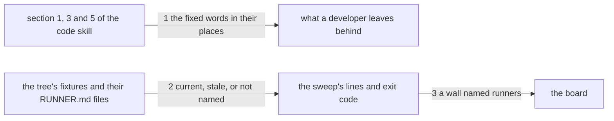

# Drawing: nothing-stale

_Written in architect mode from `requirements/nothing-stale`, six criteria,
five red tests (the archive was the analyst's act). The human approves by
merge._

## Structure

What exists: `skills/code/SKILL.md` sections 1, 3 and 5; `bin/kaal.mjs`,
the `runner` branch of the dispatch; `bin/lib/runner.mjs` with
`renderRunner` and `runnerPath`; `kaal.config.json` with its gates list;
`bin/lib/gates.mjs`, which runs each wall and prints the board.

What is new:

- Four sentences in the code skill, each where the developer is when the
  staleness happens: section 1 gains the fixture walk (a change to a
  contract walks every fixture that carries the old shape, and names the
  fixtures that must stay as they are); the build rules in section 3 gain
  the two lines about reading prose with whitespace folded and writing a
  generated file as the formatter would; section 5 gains the sentence that
  a task whose tests are all green is closed in the same change.
- **A sweep in `kaal runner`**: `runner --check` with no skill and no
  fixture walks `skills/*/fixtures/*/`, compares every `RUNNER.md` it
  finds with the document the tree renders, and ends by exit code.
- **A `runners` wall** in the gates list, running that command.

What changes: `bin/kaal.mjs` (the runner branch grows the no-argument
sweep), `kaal.config.json` (one gate), `skills/code/SKILL.md` (four
sentences). `bin/lib/runner.mjs` does not change: the sweep renders with
the function that already exists.

## Seams

1. **the skill's text to the developer**: in, the three sections; out, a
   build that leaves nothing stale. The contract: each fixed phrase stands
   in its own section and in no other.
2. **the tree to the sweep's verdict**: in, a root's skills, their
   fixtures, and the `RUNNER.md` files that exist; out, one line per file
   found and an exit code. The contract: on `fixtures/tree-stale` the
   command exits 1 and names `skills/x/fixtures/f/RUNNER.md` as stale; on
   `fixtures/board` it exits 0 and names the same path as current; neither
   run names `fixtures/g`, which carries no runner and is not stale.
3. **the sweep's verdict to the board**: in, the exit code; out, a wall on
   the board under its name. The contract: `kaal gates` on
   `fixtures/board` prints a line for a wall named `runners` and reads
   `ok`, and the board exits 0.

## Fixed and free

- Fixed: the place of each sentence (criteria 1 to 4). The sweep's two
  lines, since the acceptance test reads them: `runner: <path> is current`
  on stdout, `runner: <path> is stale` on stderr, the path relative to the
  root with forward slashes. The wall's name, `runners`. A fixture with no
  `RUNNER.md` is not named and is not a finding.
- Free: the order the sweep walks in; whether the sweep prints a summary
  line; the wall's `fix` text; how the skill's four sentences are worded
  around their fixed words.

For a text change the parts are the sentences' places and the fixed words
are what the contract reads; for the sweep the fixed thing is its two
lines, because a wall's finding is read by a person and by a test.

## Decisions

### The sweep is the same command with no arguments, not a new one

- Chosen: `kaal runner --check` with no skill and no fixture sweeps the
  tree; with both, it checks one file, as before.
- Not taken: `kaal runners`, a new command; a `--all` flag on the runner.
- Because: the tool has one entry per act, and this is the same act over
  every fixture; the wall's command then reads as what a person would
  type. The usage line already carries `runner`, so nothing new is
  learned by a reader of the tool.
- Reopens if: a second sweep of a different kind wants the same shape;
  then both become `kaal check <what>`.

### A fixture with no runner is silent, not a finding

- Chosen: the sweep names only the files that exist.
- Not taken: naming every fixture that lacks a runner; requiring one per
  fixture.
- Because: a runner is opt-in until a fixture has earned one (the
  eval-runner drawing said so), and a wall that demands one for every
  fixture would make the league's own tree red on the day it landed.
- Reopens if: the runner earns its place for every fixture; then the wall
  says which are missing, and that is a new criterion.

## Test strategy

| criterion | layer      | kind          | why                                      |
| --------- | ---------- | ------------- | ---------------------------------------- |
| 1         | contract 1 | deterministic | the build rules, read                    |
| 2         | contract 1 | deterministic | section 1, read                          |
| 3         | contract 1 | deterministic | the build rules, read                    |
| 4         | contract 1 | deterministic | section 5, read                          |
| 5         | contract 2 | deterministic | the sweep on two fixture roots           |
| 5         | contract 3 | deterministic | the wall on the board, on a fixture root |
| 6         | acceptance | deterministic | the archive, by the requirement          |

## Handoff

- Task: nothing-stale
- Seams: 3; contract tests: 3 (equal), beside this file; fixture roots
  `fixtures/tree-stale` and `fixtures/board` here
- Red run: all three failing; the build, four sentences, the sweep and one
  gate, turns them green
- Criteria served: seam 1 serves 1 to 4; seams 2 and 3 serve 5; criterion
  6 is the requirement's own
- Next: the human approves by merge; then `code`
