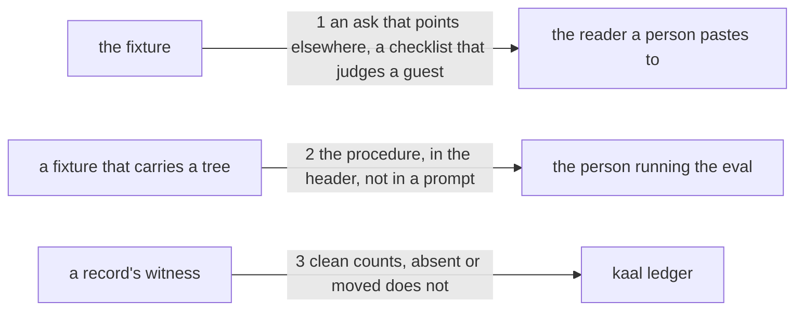

# Drawing: pointed-elsewhere

_Written in architect mode from `requirements/pointed-elsewhere`, four
criteria and four red tests. The closed requirements and their tests were
read first, which this skill now requires: `eval-runner` fixes that the
runner is generated from the tree and that a fixture's `RUNNER.md` is kept
current by a wall; `eval-record-v1` fixes the record's ten fields and its
unit test iterates `FIELDS`, so a new field required of every record would
make every existing record incomplete; `nothing-stale` fixes freshness by
three shas; `witness-a-tree` gives the command this fixture leans on, and
its own decision says a git working copy is witnessed by git, which is why
the tree here is not one. The human approves by merge._

## Structure

What exists: `skills/analyse/fixtures/`, holding fixtures of ask and
expect; `bin/lib/runner.mjs`, which renders the page a person copies from;
`bin/lib/record.mjs`, which says what a record must carry and which
records count; `evals/README.md`, which names the same fields.

What is new:

- **`skills/analyse/fixtures/pointed-elsewhere/`**: `ask.md`, pointing the
  skill at a directory it was given; `expect.md`, judging the guest
  behaviour; and `tree/`, at least two files with one nested, and no
  `.git`.
- **`RUNNER.md`** for that fixture, generated.

What changes:

- **`bin/lib/runner.mjs`**: when the fixture carries a `tree/`, the page
  gains the guest procedure, in the header and not inside a prompt.
- **`bin/lib/record.mjs`**: a reading that says whether a record's witness
  is acceptable, used where the fixture is visible, so a record for a
  fixture with a tree counts only when it says the tree was untouched.
- **`evals/README.md`**: the field named beside the ten.

## Seams

1. **an ask that points elsewhere, a checklist that judges a guest**: in,
   the fixture's `ask.md` and `expect.md`; out, an ask naming a directory
   and no place inside the league, and three checklist items that reach
   the reading prompt: that the output names which of the two places it is
   acting in, that it writes nothing into the directory it was pointed at,
   and that it hands the work over and asks where the work lands. The
   contract reads the rendered reading prompt, because the renderer keeps
   only lines shaped like items and an item written as a paragraph would
   never reach the reader.
2. **the procedure, in the header, not in a prompt**: in, a fixture that
   carries a `tree/`; out, a page whose header says to copy the tree
   outside the repository, witness the copy, run, and witness it again
   against that manifest, and that a tree that moved fails the run
   whatever the output said; and a fixture with no tree whose page says
   none of it. The contract drives both fixtures and reads the page.
3. **clean counts, absent or moved does not**: in, a root holding a
   fixture with a tree and three records, one saying `witness: clean`, one
   saying nothing, one saying `witness: moved`; out, `kaal ledger` on that
   root counting one model, and naming the other two with the word
   witness, the way it names a stale record. The contract drives the
   command on the requirement's fixture root.

## Fixed and free

- Fixed: that the procedure is in the page's header and never inside
  prompt one; that the checklist items are `- ` bullets, so the renderer
  keeps them; that the record's ten fields do not change and `witness` is
  required only where the fixture carries a tree; that a record whose
  witness is missing or not `clean` counts for nothing and the reason
  names it; that the tree holds no `.git`; and that the fixture's
  `RUNNER.md` is generated in the same change.
- Free: the ask's subject and the tree's contents; the wording of the
  procedure beyond the phrases the contract reads; where in
  `bin/lib/record.mjs` the new reading lives and what it is called;
  whether the runner detects the tree by `existsSync` or by a listing.

## Decisions

### The procedure is for the person, so it is not in the prompt

- Chosen: the guest procedure goes in the page's header, above the prompt
  blocks, where the page already tells a person what to do with them.
- Not taken: inside prompt one, beside the skill and the ask.
- Because: prompt one is pasted into a model, and a model told to copy a
  tree and run a witness would try. The copying, the witnessing and the
  verdict are the person's acts; the model's world is the skill and the
  ask. Mixing the two would also make the skill's sha cover instructions
  the skill never gave.
- Reopens if: the evals workflow ever runs a guest fixture unattended, at
  which point the procedure is a script and not a paragraph.

### `witness` is required by the fixture, not by the record

- Chosen: the ten fields stand; a separate reading says a record for a
  fixture that carries a tree must say `witness: clean`, and it is used
  where the root and the skill are known.
- Not taken: an eleventh entry in `FIELDS`, which reads more simply.
- Because: `eval-record-v1` is closed and its unit test iterates `FIELDS`
  to say every record carries every one of them. An eleventh field would
  make every record in the tree incomplete at once, which is a supersede
  of a closed task for the convenience of a shorter rule, and the closed
  task's own principle (a record counts only when complete) does not push
  that way.
- Reopens if: every fixture carries a tree, when the condition is always
  true and the field is simply required.

### The README names the field outside the list of ten

- Chosen: `witness` is documented in its own short section of
  `evals/README.md`, not as one of the `- \`name\`:` bullets.
- Not taken: adding it to that list, which is where a reader looks first.
- Because: `evals-v2` is closed and its contract derives the evals
  workflow's template from exactly those bullets, requiring the template to
  write every one. That list means the fields every record carries, and
  `witness` is required by the fixture rather than by every record; putting
  it there would demand that an unattended workflow write a verdict about a
  filesystem it never touched. The closed task's own principle pushes
  against the criterion, so the criterion gives way and the requirement
  says so.
- Reopens if: every fixture ships a tree, or the workflow learns to copy
  and witness one, at which point the field is universal and belongs in the
  list.

### The runner reads the tree, and is never told about it

- Chosen: the page carries the procedure when `tree/` is there.
- Not taken: a flag in the fixture, or a manifest naming its kind.
- Because: the tree is visible on disk, and a second declaration of the
  same fact is a thing to keep true. `eval-runner` already fixed that the
  page is generated from the tree rather than maintained beside it.
- Reopens if: a fixture ever needs a tree that is not the target of the
  run, at which point the directory's presence stops meaning one thing.

## Test strategy

| criterion | layer      | kind          | why                                                     |
| --------- | ---------- | ------------- | ------------------------------------------------------- |
| 1         | acceptance | deterministic | the files, the tree, the ask that names no league place |
| 2         | contract 1 | deterministic | the three items, as the reader receives them            |
| 3         | contract 2 | deterministic | the procedure on one page and absent from the other     |
| 4         | contract 3 | deterministic | one model counted, two named for their witness          |

## Handoff

- Task: pointed-elsewhere
- Seams: 3; contract tests: 3 (equal), beside this file; fixture root
  `requirements/pointed-elsewhere/fixtures/guest-records`
- Red run:
  `node --test --test-timeout=60000 architecture/pointed-elsewhere/contracts.test.mjs`;
  all three red, run and read. Stand-in green: all three, on a scratch
  fixture, a runner that reads the tree and a record reading in
  `bin/lib/record.mjs`, discarded
- Criteria served: seam 1 serves 2; seam 2 serves 3; seam 3 serves 4;
  criterion 1 is held by its acceptance test alone, since the fixture's
  existence is not a boundary anything crosses
- Fixed for the developer: the header placement, the bullet shape, the
  untouched ten fields, the reason naming, and the generated `RUNNER.md`
- Next: the human approves by merge; then `code`
