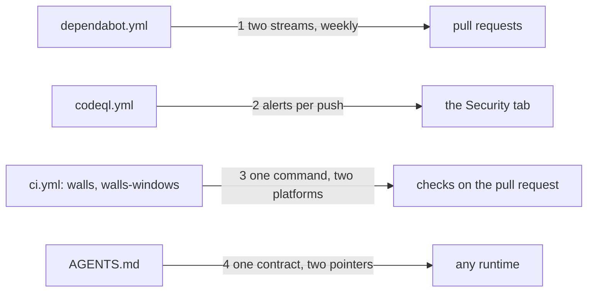

# Drawing: public-v1

_Written in architect mode from `requirements/public-v1`, six criteria, six
red tests. The human approves by merge._

## Structure

What exists: `.github/workflows/ci.yml` (one job, `walls`), `evals.yml`,
`README.md`, `SECURITY.md`, `DESIGN.md`, the pre-push hook.

What is new, all of it files GitHub reads on its own:

- **`dependabot.yml`**: two update streams, actions and npm, weekly, with
  limits; the npm stream groups the dev tooling so prettier bumps arrive
  as one pull request.
- **`CODEOWNERS`**: one owner for the tree, and the workflows and `bin/`
  named again so a review request cannot be missed on the walls' own code.
- **`codeql.yml`**: the advanced setup, `javascript-typescript`, no build,
  on pull requests, pushes to main and Saturdays.
- **A second job in `ci.yml`**, `walls-windows` on `windows-latest`, the
  same three steps; `walls` keeps its name and platform.
- **`AGENTS.md`**: the contract for any runtime: how to read the board,
  what a red means on a change, the way past a red, the lane rule, where
  the design and the skills are. **`CLAUDE.md`** and
  **`.github/copilot-instructions.md`** point at it in under thirty lines.
- **`FUNDING.yml`**: the sponsors account.

What changes: the action majors in `ci.yml` and `evals.yml` go to the ones
khai pins (`checkout@v7`, `setup-node@v7`, `github-script@v9`).

## Seams

1. **dependabot to pull requests**: in, the two streams; out, weekly pull
   requests the walls run on. Owned by the file on one side, GitHub on the
   other. The contract: both ecosystems, weekly, limited.
2. **codeql to the Security tab**: in, the workflow; out, alerts on every
   push and a weekly sweep. The contract: the permission and the triggers.
3. **ci to checks**: in, the one command; out, two checks, `walls` (the
   required one) and `walls-windows` (the proof gates-v2 lacked). The
   contract: both jobs run `npm test` and nothing else as their test step,
   and the required job's name and platform do not change.
4. **contract to runtimes**: in, `AGENTS.md`; out, one reading in every
   runtime, through pointer files that carry nothing of their own. The
   contract: the five sentences the requirement names, and pointers under
   thirty lines.

## Fixed and free

- Fixed: the job name `walls` on `ubuntu-latest` (criterion 4); the five
  sentences of `AGENTS.md` (criterion 5); the action majors; the two
  Dependabot streams.
- Free: the grouping in `dependabot.yml`; the CodeQL schedule's hour; the
  wording of `AGENTS.md` beyond the five sentences.

## Decisions

### A second job, not a matrix

- Chosen: `walls-windows` beside `walls`.
- Not taken: `strategy.matrix.os`, which renames every check to
  `walls (os)`.
- Because: `walls` is a required check by a setting Kai made; a rename
  would silently unrequire it. A second job adds proof without touching
  the setting.
- Reopens if: Kai makes the Windows job required too; then a matrix and
  two required names.

### The contract at the root, the vendors pointing at it

- Chosen: `AGENTS.md` carries the text; `CLAUDE.md` and
  `copilot-instructions.md` carry a pointer.
- Not taken: the contract in the README; a copy per vendor file.
- Because: the runtime that misread the board on Windows read no contract
  at all; a file named for it, pointing at one text, is the cheapest fix,
  and two copies drift (khai learned this).
- Reopens if: the standard names a different file.

## Test strategy

| criterion | layer      | kind          | why                                   |
| --------- | ---------- | ------------- | ------------------------------------- |
| 1         | contract 1 | deterministic | the streams, read from the file       |
| 3         | contract 2 | deterministic | triggers and permission, read         |
| 4         | contract 3 | deterministic | job names, platforms, the one command |
| 5         | contract 4 | deterministic | the sentences and the pointers        |
| 2, 6      | acceptance | deterministic | one file each, by the requirement     |

## Handoff

- Task: public-v1
- Seams: 4; contract tests: 4 (equal), beside this file
- Red run: all four failing; the build turns them green
- Criteria served: seam 1 serves 1; seam 2 serves 3; seam 3 serves 4; seam
  4 serves 5; criteria 2 and 6 are the requirement's own
- Next: the human approves by merge; then `code`; the settings are Kai's
