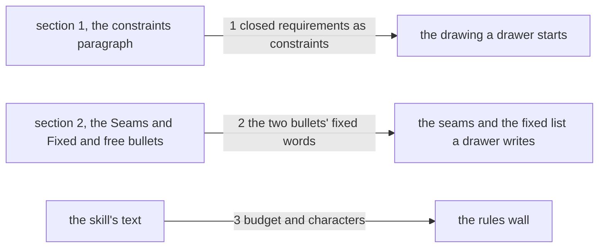

# Drawing: read-before-drawing

_Written in architect mode from `requirements/read-before-drawing`, five
criteria, three red tests (the fence and the archive were the analyst's
acts). The human approves by merge._

## Structure

What exists: `skills/architect/SKILL.md` section 1 (the paragraph on
constraints as walls), section 2 with the bullets **Seams** and **Fixed and
free**; `architecture/eval-runner/fixtures/tree/skills/y/SKILL.md`, which
now carries a fence.

What is new, three sentences, each where the drawer is when the miss
happens:

- Section 1, after the sentence on constraints as walls: read the closed
  requirements whose criteria touch the path as constraints too, before
  drawing; the acceptance wall reads them whether the drawing did or not.
- **Seams** grows one sentence: a change to a reader that several seats
  share (a parser, a template) is a seam for every reader; the drawing
  names the readers and fixes the behaviour they keep.
- **Fixed and free** grows one sentence: for a text change the parts are
  the sentences' places, and the fixed words are what the contract reads.

What changes: `SKILL.md` only. The template `references/drawing.md` does
not change; the three are reading rules, not shapes.

## Seams

1. **section 1 to the drawing's start**: in, the paragraph; out, a drawing
   that read the closed requirements first. The contract: section 1
   carries "closed requirements", "as constraints" and "acceptance wall
   reads them", and section 2 does not carry the first of these, so the
   rule is read before the drawing and not during it.
2. **the two bullets to the drawer's lists**: in, the Seams bullet and the
   Fixed and free bullet; out, a shared reader drawn as a seam per reader,
   and a text change drawn by its places and fixed words. The contract:
   the Seams bullet carries "several seats share", "a seam for every
   reader" and "names the readers"; the Fixed and free bullet carries
   "text change", "sentences' places" and "fixed words are what the
   contract reads"; each phrase in its bullet and in no other.
3. **the skill's text to the rules wall**: in, the grown text; out, a
   green `kaal check` on the league's skills.

## Fixed and free

- Fixed: the place of each sentence (criteria 1 to 3); the fixed words
  under Seams; the eval-runner fixture keeps its fence (criterion 4).
- Free: the wording around the fixed words.

For a text change the parts are the sentences' places, and the fixed words
are what the contract reads; the second bullet's sentence is this drawing's
own rule, applied to itself.

## Decisions

### The closed-requirements rule in section 1, not as a Fixed and free item

- Chosen: one sentence in section 1, where the drawer reads the
  constraints.
- Not taken: a line under **Fixed and free** saying closed requirements
  are fixed; a wall that lists them (the requirement's open question).
- Because: the miss in public-v1 happened before any list was written; the
  drawer had not read security-v1 at all. A rule about reading belongs
  where reading is described. The wall stays open until a rule can name
  which requirements touch a path.
- Reopens if: the wall lands; then the sentence points at it.

## Test strategy

| criterion | layer      | kind          | why                                                              |
| --------- | ---------- | ------------- | ---------------------------------------------------------------- |
| 1         | contract 1 | deterministic | section 1, read                                                  |
| 2         | contract 2 | deterministic | the Seams bullet, read                                           |
| 3         | contract 2 | deterministic | the Fixed and free bullet, read                                  |
| 1 to 3    | contract 3 | deterministic | the rules wall on the grown skill                                |
| 4         | acceptance | deterministic | the fence, by the requirement, held by the eval-runner contracts |
| 5         | acceptance | deterministic | the archive, by the requirement                                  |

## Handoff

- Task: read-before-drawing
- Seams: 3; contract tests: 3 (equal), beside this file
- Red run: contracts 1 and 2 failing, contract 3 green before the build
  and to be kept; the build, three sentences, turns the two green
- Criteria served: seam 1 serves 1; seam 2 serves 2 and 3; seam 3 serves
  1 to 3; criteria 4 and 5 are the requirement's own
- Next: the human approves by merge; then `code`
