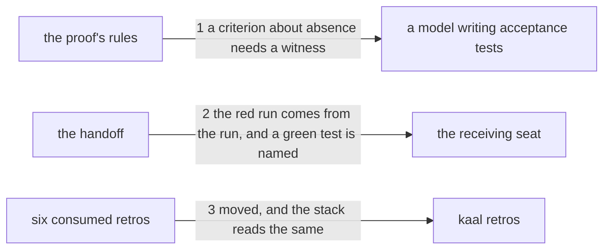

# Drawing: red-for-the-right-reason

_Written in architect mode from `requirements/red-for-the-right-reason`,
three criteria and three red tests. Drawn beside
`what-a-closed-task-fixes`, which came from the same analyst run and edits
the same file; the two touch different sections and land in one pull
request, which the requirements say. The closed requirements and their
tests were read first: `analyse-v2` and `analyse-v3` fix the shape of this
skill's numbered sections, and `nothing-stale` fixes that a record says
its shas, so the analyse eval records go stale when this text moves, which
is honest and needs no action. `eval-runner` fixes that prompt one is the
whole skill, so the fixture's `RUNNER.md` is regenerated in the build. The
human approves by merge._

## Structure

What exists: `skills/analyse/SKILL.md`, whose `## 3. Write the proof`
carries the rules a test must meet, one bullet each, and whose
`## 5. Hand off` says what the handoff names; `retros/`, the stack the
analyst reads, and `retros/archive/`, where consumed retros go.

What changes: one new bullet in section 3; one sentence added to the
handoff paragraph in section 5; six files moved from `retros/` to
`retros/archive/`. `skills/analyse/fixtures/json-flag/RUNNER.md` is
regenerated because the skill moved.

Nothing is new and nothing in `bin/` changes.

## Seams

1. **a criterion about absence needs a witness**: in,
   `## 3. Write the proof`; out, a bullet in the same shape as the rules
   beside it, saying that a criterion whose subject is something not
   happening needs a test that proves the thing could have happened, and
   that a proof which passes because nothing ran is a coincidence. The
   contract reads the section, not the file, because a rule about writing
   tests that sits under Hand off is a rule most writers meet too late.
2. **the red run comes from the run, and a green test is named**: in,
   `## 5. Hand off`; out, that the red run is written from the run and
   never from the plan, and that a test green before the build is named
   there with the reason it is green. The contract reads that section and
   leaves untouched what the skill already says about a red run reported
   as not yet recorded, which `analyse-v3` fixed.
3. **moved, and the stack reads the same**: in, six retro files; out, each
   under `retros/archive/` and none under `retros/`, and `kaal retros`
   reporting the same counts it reported before the move, because a retro
   is consumed when a requirement names its filename and not when it
   changes directory. The contract drives the command and reads the tree.

## Fixed and free

- Fixed: that the absence rule is a bullet inside section 3 and not
  anywhere else; that the red run sentence is inside section 5; the
  phrases the tests read (`something not happening`, `could have
happened`, `coincidence`, `from the run, never from the plan`, `green
before the build`, `the reason it is green`); that the six files move and
  are not deleted; and that `RUNNER.md` is regenerated in the same change.
- Free: the bullet's title and its wording beyond those phrases; whether
  the handoff sentence joins the paragraph that is there or starts its
  own; the order of the moved files.

## Decisions

### The absence rule is a bullet in the proof, not a line in the handoff

- Chosen: `## 3. Write the proof`, beside **Seen red** and **Seen green on
  a stand-in**.
- Not taken: the handoff, where the red run is already discussed.
- Because: it is a rule about how a test is written, and it has to be met
  while the test is being written. A writer who meets it at handoff has
  already written the test that cannot fail and will read the rule as a
  reproach rather than as help.
- Reopens if: section 3 grows past what a reader takes in at once, which
  would be a reason to split the rules rather than to move this one.

### The stack's move is a seam, not a chore

- Chosen: a contract that the six are archived and that `kaal retros`
  reports the same counts after the move as before.
- Not taken: treating the move as a step in the build with no test, since
  the criterion already says where the files must be.
- Because: the promise worth holding is not that files moved, it is that
  moving them changed nothing the stack reports. Consumption is by name;
  if it were ever by location, this move would silently reset a count and
  the next analyst run would read a stack that had already been read.
- Reopens if: the retro reader ever learns to read `retros/archive/`, at
  which point the counts do change and the promise is a different one.

## Test strategy

| criterion | layer      | kind          | why                                                    |
| --------- | ---------- | ------------- | ------------------------------------------------------ |
| 1         | contract 1 | deterministic | the bullet, inside the section that governs it         |
| 2         | contract 2 | deterministic | the sentence, inside the handoff section               |
| 3         | contract 3 | deterministic | archived, gone from the stack, counts unchanged        |
| 1, 2      | eval       | harnessed     | whether a model writes a witness; reports, never gates |

## Handoff

- Task: red-for-the-right-reason
- Seams: 3; contract tests: 3 (equal), beside this file
- Red run:
  `node --test --test-timeout=60000 architecture/red-for-the-right-reason/contracts.test.mjs`;
  all three red. Stand-in green: all three, on a scratch edit of the skill
  and a copy of the six files, discarded
- Criteria served: seam 1 serves 1; seam 2 serves 2; seam 3 serves 3
- Fixed for the developer: the two sections, the six phrases, that the
  files move rather than being deleted, and the regenerated `RUNNER.md`
- Next: the human approves by merge; then `code`
