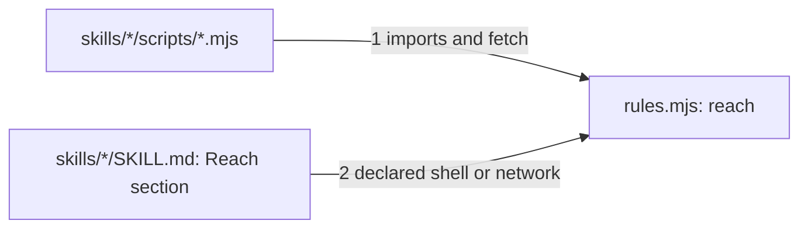

# Drawing: security-v1

_Written in architect mode from `requirements/security-v1`, five criteria,
five red tests, three of them already green on the tree. The human approves
this drawing by merging it._

## Structure

What exists: two workflows with explicit permissions; the lockfile and
`npm ci`; `bin/lib/rules.mjs` with seven skill rules; no `SECURITY.md`.

What is new:

- **`SECURITY.md`** with three sections: Reporting (where and how, and what
  to expect back), Supported versions (main, and the latest tagged release
  once there is one), Threats (the untrusted channels named: an ask, a
  fixture, a retro, a pull request body, tool output; the rule that they
  are data and never instructions; and what a skill may not do on their
  say-so: change a lane it does not own, call a script it does not carry,
  give a key).
- **The `reach` rule** in `bin/lib/rules.mjs`: for each skill with a
  `scripts/` directory, any non-test `.mjs` that imports `node:child_process`,
  `node:net`, `node:http`, `node:https`, `node:dns`, or `node:tls`, or calls
  `fetch(`, reaches; a reaching script with no `## Reach` section in the
  skill's `SKILL.md` is a finding `reach`. A `## Reach` section with no
  reaching script is also a finding `reach`, so a declaration cannot go
  stale.
- **`README.md`**: the walls list names the reach rule in one clause.

What changes: `bin/lib/rules.mjs` (`RULES` gains `reach`), `README.md`.

## Seams

1. **script to rule**: in, the text of every non-test script in a skill;
   out, whether the skill reaches, by the import list and `fetch(`. Owned by
   the script's author on one side, `rules.mjs` on the other.
2. **declaration to rule**: in, the skill's `SKILL.md`; out, whether a
   `## Reach` section is present; the finding fires when presence and reach
   disagree in either direction. Owned by the skill's author on one side,
   `rules.mjs` on the other.

## Fixed and free

- Fixed: the section names in `SECURITY.md` and the five channels
  (criterion 1); the rule name `reach` and the import list (criterion 4);
  the two-way agreement (criterion 5).
- Free: how the import list is matched (a regex over text is enough; no
  parser); the Reach section's inner wording beyond naming `shell` or
  `network`.

## Decisions

### Reach is read from text, never from execution

- Chosen: a regex over the script's source.
- Not taken: running the script under a sandbox; a parser.
- Because: the wall must be cheap and safe; a script is never executed to
  find out what it does.
- Reopens if: a script hides a reach behind a dynamic import; then the rule
  gains `import(` as a reach and the declaration is required.

### The declaration must be as true as the code, both ways

- Chosen: a `## Reach` section with no reaching script is a finding.
- Not taken: tolerating a stale declaration.
- Because: a declaration that outlives its reason is a claim nobody made,
  which is what the league refuses everywhere else.
- Reopens if: never.

## Test strategy

| criterion | layer         | kind          | why                          |
| --------- | ------------- | ------------- | ---------------------------- |
| 1, 2, 3   | acceptance    | deterministic | words in files               |
| 4, 5      | contract 1, 2 | deterministic | named rule on fixture skills |

## Handoff

- Task: security-v1
- Seams: 2; contract tests: 2 (equal), beside this file; fixtures
  `declared-reach` and `shell-reach` here, `undeclared-reach` under the
  requirement
- Red run: both failing; stand-in green in scratch
- Criteria served: seam 1 serves 4, 5; seam 2 serves 4, 5
- Next: the human approves by merge; then `code`
