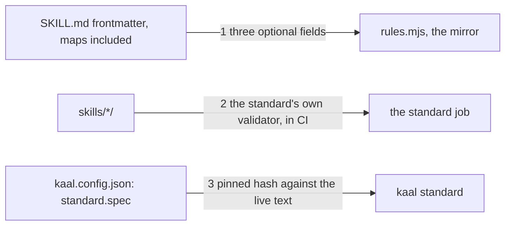

# Drawing: standard-v1

_Written in architect mode from `requirements/standard-v1`, four criteria,
four red tests. The human approves by merge._

## Structure

What exists: `bin/lib/frontmatter.mjs` (flat `key: value` only),
`bin/lib/rules.mjs` (the mirror: name, description, license, budget, depth,
vendor, dash, reach, fixtures), `kaal.config.json` with `standard.spec`
(url, sha256, pinned), `.github/workflows/ci.yml` (two jobs).

What is new:

- **Maps in frontmatter**: a key with no value followed by indented
  `sub: value` lines parses to an object; a key with no value and nothing
  indented stays the empty string, so every reader of the parser (records,
  waivers, retros) sees what it saw.
- **Three mirror rules** in `rules.mjs`, after `license`:
  `compatibility` (a string of 1 to 500 characters when present),
  `allowed-tools` (a non-empty string when present), `metadata` (an object
  whose values are all strings when present). Same finding shape.
- **`bin/lib/standard.mjs`**, `compareSpec(root, source)`: reads the pin
  from the config, hashes the source (a local path, or the pinned URL
  fetched when no path is given), and returns `{ live, pinned, same }`.
  `kaal standard [file]` prints `standard: the pinned spec is unchanged
(<hash>)` and exits 0, or `standard: the spec drifted from the pin: live
<hash>, pinned <hash>; reconcile the mirror rule by rule, then re-pin`
  on stderr and exits 1. It changes nothing.
- **`standard.validator`** in the config: `{ repo, ref, install }`, the
  commit the validator is installed at.
- **A `standard` job** in `ci.yml`: node and python, the validator
  installed at the pinned commit, `skills-ref validate` over `skills/*/`,
  then `kaal standard`; and a weekly schedule on the workflow.

What changes: `frontmatter.mjs`, `rules.mjs`, `kaal.mjs` (dispatch,
usage), `kaal.config.json`, `ci.yml`, `README.md`.

## Seams

1. **frontmatter to mirror**: in, a skill's frontmatter with the optional
   fields; out, a finding per malformed field, none for well-formed ones.
   Owned by the parser and `rules.mjs`. The contract: the four fixture
   skills under the requirement, three refused by the named rule and one
   accepted; and a parsed map is an object of strings.
2. **tree to validator**: in, every skill directory; out, the reference
   validator's verdict, in a CI job that is red on any refusal. Owned by
   the workflow. The contract: the job exists, installs at the config's
   commit, validates `skills/*/`, and the workflow has a schedule.
3. **pin to live text**: in, the config's url and hash, or a local file;
   out, unchanged or drift with both hashes. Owned by `standard.mjs`. The
   contract: on the fixture root, exit codes and messages; and the command
   never writes to the config.

## Fixed and free

- Fixed: the three rule names (criterion 1); the job name `standard` and
  its three steps (criterion 2); the two message shapes and exit codes
  (criterion 3); the parser's empty-value behaviour.
- Free: how the map is parsed beyond one level (the spec allows one);
  the schedule's day; whether the README sentence lives in the walls
  section or a section of its own.

## Decisions

### The validator in CI, not in the walls

- Chosen: a third job in `ci.yml`, python and the reference library.
- Not taken: a wall that shells out to `skills-ref`; a node port of the
  validator.
- Because: the walls are node-only and offline by design, and a port is a
  second mirror that would need the same reconciling; the reference
  library is the standard's own reading and belongs in CI where a python
  is one step away.
- Reopens if: the standard ships the validator for node; then a wall.

### Drift is reported, never repaired

- Chosen: `kaal standard` prints and exits; re-pinning stays a hand edit
  of the config after reconciling the mirror.
- Not taken: writing the new hash into the config on request.
- Because: the pin says "the mirror matches this text"; a tool that moves
  the pin without moving the mirror makes the sentence false.
- Reopens if: never.

## Test strategy

| criterion | layer      | kind          | why                                 |
| --------- | ---------- | ------------- | ----------------------------------- |
| 1         | contract 1 | deterministic | fixture skills through the command  |
| 2         | contract 2 | deterministic | the job, read                       |
| 3         | contract 3 | deterministic | exit codes, messages, config intact |
| 4         | acceptance | deterministic | the README, by the requirement      |

## Handoff

- Task: standard-v1
- Seams: 3; contract tests: 3 (equal), beside this file
- Red run: all three failing; the build turns them green
- Criteria served: seam 1 serves 1; seam 2 serves 2; seam 3 serves 3;
  criterion 4 is the requirement's own
- Next: the human approves by merge; then `code`
