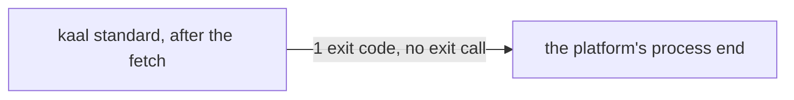

# Drawing: standard-v2

_Written in architect mode from `requirements/standard-v2`, one criterion,
one red test. The human approves by merge._

## Structure

What exists: the `standard` branch of `bin/kaal.mjs`, which awaits
`compareSpec` and then calls `process.exit`; the `standard` job in
`ci.yml` on one platform.

What changes: the command sets `process.exitCode` and returns, so the
process ends when the fetch's handles have closed; the job becomes a
matrix over the two platforms, and the validator loop names `bash`.

## Seams

1. **command to process end**: in, the comparison's result; out, an exit
   code the platform reads after the loop drains, on Linux and on Windows.
   Owned by `kaal.mjs`. The contract: the job that runs the command on
   Windows is green, which the workflow's text commits to.

## Fixed and free

- Fixed: no `process.exit` after an awaited fetch (criterion 1, by the
  Windows run); the job's name and the two platforms.
- Free: whether the other branches of the dispatcher keep their
  synchronous `process.exit`; they open no handles.

## Decisions

### Exit code, not exit call

- Chosen: `process.exitCode` after the fetch; the process ends by itself.
- Not taken: closing undici's dispatcher by hand before exiting.
- Because: the crash is the runtime's own teardown racing an exit call;
  not calling exit is the whole fix, and it holds on every platform.
- Reopens if: a future command must exit early with handles open.

## Test strategy

| criterion | layer      | kind          | why                                  |
| --------- | ---------- | ------------- | ------------------------------------ |
| 1         | contract 1 | deterministic | the workflow's text; CI is the proof |

## Handoff

- Task: standard-v2
- Seams: 1; contract tests: 1 (equal), beside this file
- Red run: failing; the build turns it green
- Criteria served: seam 1 serves 1
- Next: the human approves by merge; then `code`
