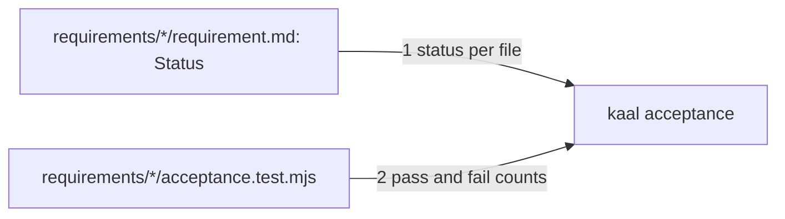

# Drawing: status-v1

_Written in architect mode from `requirements/status-v1`, four criteria,
four red tests. Approved with the build it unblocks, by the same merge._

## Structure

What exists: `bin/kaal.mjs` with `gates`, `ledger`, `check`, `retros`;
`bin/lib/gates.mjs` with `wallEnv`; the acceptance wall as `node --test
requirements/*/acceptance.test.mjs`.

What is new:

- **A status line** in every `requirement.md`'s Handoff: `- Status: open`
  or `- Status: closed`. The analyst writes `open` at handoff and `closed`
  when every criterion is green. No default.
- **`acceptance` as a fifth command**, backed by `bin/lib/acceptance.mjs`:
  takes test files, reads each one's sibling `requirement.md` for its
  status, runs each file under `wallEnv`, reads its pass and fail counts,
  and applies four verdicts: closed and red is `FAIL`; open and red is `open`
  (reported, not failed); open and all green is `FAIL close it`; no status
  is `FAIL`. One line per requirement, exit 1 if any `FAIL`.

What changes: `kaal.config.json` (the acceptance wall's command), `README.md`
(one clause in the walls list), and the three existing requirements (a
status line each: skills-v1 closed, gates-v1 closed, push-v1 open).

## Seams

1. **requirement to command**: in, `- Status: open|closed` in the Handoff
   of the `requirement.md` beside each test file given; out, the verdict per
   requirement above. Owned by the analyst on one side, `acceptance.mjs` on
   the other.
2. **test file to command**: in, a `node --test` file run under `wallEnv`;
   out, its `# pass N` and `# fail M` read from the output. Owned by node's
   test runner on one side, `acceptance.mjs` on the other.

## Fixed and free

- Fixed: the status line's exact form (criterion 1); the four verdicts and
  the exit code (criterion 2); the command in the wall keeps the glob
  (criterion 3 and gates-v1's criterion 5); every test file runs under
  `wallEnv` (gates-v1's lesson).
- Free: line format; whether files run in parallel; how counts are parsed
  beyond the two summary lines.

## Decisions

### An open requirement's reds are reported, never counted as failures

- Chosen: `open` with counts on the line, exit unaffected.
- Not taken: an advisory flag on the gate; skipping open requirements.
- Because: skipping would hide the red run the analyst made on purpose;
  a flag changes the gates schema gates-v1 fixed. Reporting keeps the
  number visible and the verdict honest.
- Reopens if: open requirements pile up and the report drowns the board.

### An all-green open requirement fails

- Chosen: `FAIL close it`.
- Not taken: silently passing.
- Because: a green requirement nobody closed is a claim left unmade, and the
  board must force the analyst's act rather than let it drift.
- Reopens if: a requirement is legitimately green before its handoff, which
  should not happen, since the proof lands red first.

## Test strategy

| criterion | layer      | kind          | why                         |
| --------- | ---------- | ------------- | --------------------------- |
| 1         | acceptance | deterministic | a line in a file            |
| 2         | contract 1 | deterministic | exit codes on fixture files |
| 3         | acceptance | deterministic | a string in the config      |
| 4         | acceptance | deterministic | the runner's exit code      |

## Handoff

- Task: status-v1
- Seams: 2; contract tests: 2 (equal), beside this file, on the
  requirement's own fixtures
- Red run: both failing; stand-in green in scratch
- Criteria served: seam 1 serves 1, 2, 4; seam 2 serves 2, 4
- Next: the developer, in the same change, since the hook will not let the
  build through without it
