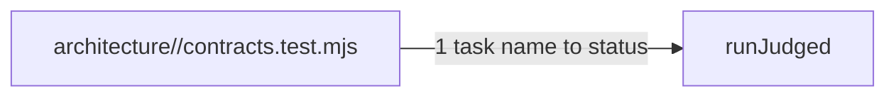

# Drawing: status-v2

_Written in architect mode from `requirements/status-v2`, three criteria,
three red tests. Approved with the build it unblocks, by the same merge, as
status-v1 was: the hook will not let the drawings through without it._

## Structure

What exists: `bin/lib/acceptance.mjs` with `readStatus` (the requirement
beside the test file), `judge` (the four verdicts) and `runAcceptance`; the
contracts wall as `node --test architecture/*/contracts.test.mjs`.

What is new:

- **A second status lookup**, `statusForDrawing(testFile)`: the task is the
  drawing's directory name; the status is read from
  `requirements/<task>/requirement.md` two levels up; no requirement means no
  status.
- **One judged runner**, `runJudged(files, statusFor)`, which
  `runAcceptance` and the new `runContracts` both call; the verdict table is
  not duplicated.
- **`contracts` as a sixth command** on `bin/kaal.mjs`, and the contracts
  wall's command changed to `node bin/kaal.mjs contracts
architecture/*/contracts.test.mjs`.

## Seams

1. **drawing to task status**: in, a contract test file; out, the status of
   `requirements/<task>/requirement.md` for the task the directory names, or
   null. Owned by the analyst's requirement on one side, `acceptance.mjs` on
   the other. The verdicts and the counts are status-v1's seams, unchanged.

## Fixed and free

- Fixed: the command name and the wall's command (criteria 1, 2); the four
  verdicts (status-v1); one runner for both (constraint).
- Free: the module's file name (it stays `acceptance.mjs` in v1 rather than
  renaming a file the drawing of status-v1 named).

## Decisions

### Status is the task's, read from the requirement, never copied

- Chosen: a drawing has no status line of its own.
- Not taken: a status line in the drawing's Handoff.
- Because: two copies of one status drift; the requirement is where the
  analyst opens and closes a task.
- Reopens if: a drawing ever outlives its requirement.

### A drawing is never told to close

- Chosen: `runJudged` takes `mustClose`; the acceptance wall passes true,
  the contracts wall false, so an open task's green drawing is reported and
  never failed.
- Not taken: the same four verdicts for both.
- Because: push-v1's seams hold while its task waits on a manual step; a
  drawing's green says the shape is built, the requirement's green says the
  task is done, and only the second asks the analyst to close.
- Reopens if: a drawing ever needs a status of its own.

## Test strategy

| criterion | layer      | kind          | why                         |
| --------- | ---------- | ------------- | --------------------------- |
| 1         | contract 1 | deterministic | exit codes on fixture tasks |
| 2         | acceptance | deterministic | a string in the config      |
| 3         | acceptance | deterministic | the runner's exit code      |

## Handoff

- Task: status-v2
- Seams: 1; contract tests: 1 (equal), beside this file, on the
  requirement's fixtures
- Red run: failing; stand-in green by the build itself
- Criteria served: seam 1 serves 1 and 3
- Next: the developer, in the same change
