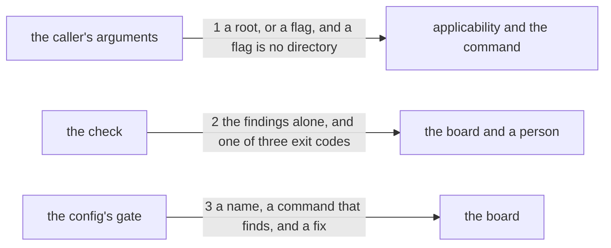

# Drawing: the-board-counts-the-reads

_Written in architect mode from `requirements/the-board-counts-the-reads`,
five criteria, four red and one a declared guard. The closed requirements
were read first: `nothing-passes-vacuously` fixes that a command finding
nothing still answers, `applies-here` fixes that applicability is per
command and never per tree, `gates-v1` fixes that a wall which cannot run is
a failure and never a skip, and `a-retro-names-what-it-read` is the task
whose priced gap this closes._

## What the runs said

- The requirement's own stand-in was refused on its first run by
  applicability: `retros: not applicable here: no skills/<name>/ under
--check`, exit 2, which the board reads as a failing wall.
- `bin/lib/applies.mjs` already carries the answer, in its `class` case:
  "Its argument is a root, but it also takes a flag, and a flag is not a
  directory." Two of nine guarded commands will take a flag after this
  change, and each writes that rule for itself.
- `kaal retros` prints two lines per skill. On this tree that is twelve
  lines, none of which the board judges.
- `kaal.config.json` holds ten gates, each a name, a command and a fix.
  `bin/lib/gates.mjs` runs each command through a shell and reads its exit
  code; a non zero code is a failing wall whatever it printed.
- Six closed test files read `SURFACE.md` and all pass with the page as it
  is, so none of them holds the sentences the requirement corrects.

## Structure

One module gains a flag, one module learns that a flag is not a root, one
config gains a gate, one page is corrected. No skill's text moves.

- **the command** (`bin/kaal.mjs`, changes): reads the argument, prints the
  counts, prints the findings and sets the exit code. It gains one branch:
  with the flag, the counts are not printed.
- **applicability** (`bin/lib/applies.mjs`, changes): asked before anything
  is read whether the question is this tree's. Its `retros` case reads the
  first argument as a root and must stop doing that when the argument is a
  flag, exactly as its `class` case already does.
- **the counter** (`bin/lib/retros.mjs`, unchanged): `countRetros` and
  `readFindings` answer as they do today. Nothing here changes what a read
  is or how one is found.
- **the board's config** (`kaal.config.json`, changes): gains a gate.
- **the board** (`bin/lib/gates.mjs`, unchanged): runs the gate's command
  and reads its exit code, which is the whole reason the check is a flag
  and not a report.
- **the surface page** (`SURFACE.md`, changes): its `retros` entry describes
  a command that changed under it two changes ago. A person reads it;
  nothing parses it.

## Seams

1. **A flag is not a root.** `kaal retros --check` asks about the working
   directory, and `kaal retros <root> --check` asks about that root. Both
   applicability and the command resolve it the same way: the first
   argument is a root when it does not begin with a dash, and otherwise
   there is no root and the working directory is the tree. A reason naming
   a directory called `--check` is a lie, and it is the lie the stand-in
   told.
2. **The check answers with findings alone.** With the flag, nothing is
   printed unless a `Read:` line names something the tree holds no skill
   for, and each such line prints once, naming the retro's filename and the
   name. The exit code is 0 with no findings, 1 with any, and 2 when the
   tree holds no skills at all. Without the flag the command prints exactly
   what it prints today.
3. **A gate that finds, not a gate that reports.** The config's new entry
   carries a name, a command whose exit code answers, and a fix a person
   can act on. The contract runs the command the config names, in a tree
   holding a bad read line, and requires it to fail: a gate whose command
   cannot find the thing it was added for is a wall in name only.

## Fixed and free

Fixed:

- `kaal retros` with no flag: its two lines per skill, their order, their
  wording, and its three exit codes. Ten closed tests read the first line
  anchored.
- The flag's spelling, `--check`, which is the tree's own word for this
  form on `runner`.
- That the flag prints findings and nothing else. A wall that prints
  numbers it does not judge is noise on a board read at a glance.
- The three exit codes, and that 2 still means the question is not this
  tree's.
- That the rule for reading the argument is the same in `applies.mjs` and
  in `bin/kaal.mjs`. Two readers disagreeing about what a root is was the
  defect, not the flag.
- The counter does not change. What a read is, and that reads are counted
  over `retros/` alone, is `a-retro-names-what-it-read`'s and stays its.
- The surface entry names both counts, that a read is never counted as
  unconsumed, what archiving does to each count, and three exit codes.

Free:

- The gate's name and where it sits among the ten. Nothing reads the count
  of walls or their order, checked by reading every test that touches the
  config.
- The finding's wording, which only a person reads; the contract asks that
  the retro and the name are both in it.
- Whether the command reads its argument once or twice, and whether the two
  modules share a helper or each carry the rule.

## Decisions

### A flag on `retros`, not a command of its own

- Options: `kaal retros --check`; a new command `kaal reads`; the board runs
  the bare command and tolerates twelve lines it does not judge.
- Chosen: a flag, spelled as `runner`'s already is.
- Why: the question is the same question, asked for a different reader. A
  new command would need its own surface entry, its own applicability entry
  and its own place in the guarded table, for an answer the existing command
  already computes.
- Bought: the shortest path to value. One branch, one config entry, no new
  surface.
- Spent: `retros` now has two output modes, and the surface page has to
  explain both to a reader who wanted one sentence.
- Reopens if: the check grows an answer of its own beyond findings, at which
  point it is a different question and deserves a name.

### The argument rule is written again, not hoisted

- Options: fix the `retros` case in `applies.mjs` the way the `class` case
  is already fixed; hoist a shared reader that every command uses to find
  its root.
- Chosen: write it again, in the `retros` case.
- Why: hoisting changes how eight other commands read their arguments, and
  two of them take arguments that are neither roots nor flags. That is a
  change to every command's front door in a task about one wall.
- Bought: the shortest path, and nothing else in the tree moves.
- Spent: the same rule is now written twice in `applies.mjs` and once in
  `bin/kaal.mjs`. A third command that takes a flag writes it a fourth time,
  and the fourth is the one that will be written wrong.
- The gap this opens, and the task that closes it: **`an-argument-is-read-once`**,
  which gives the tree one reader for a command's root and points every case
  at it. It is not this task, because it touches nine commands and this one
  touches one.
- Reopens if: a third command takes a flag, which is the moment the copy
  becomes a pattern rather than a repetition.

### The gate's contract runs the config's command, and does not run the board

- Options: read `kaal.config.json` and assert the entry is there; run
  `kaal gates` on a fixture; run the command the config names, in a fixture.
- Chosen: run the command the config names.
- Why: an entry that exists proves nothing about whether it finds anything,
  and a gate whose command cannot find the thing it was added for is a wall
  in name only. Driving `kaal gates` from a contract is refused by the
  architect skill's own rule, since the board runs the contracts.
- Bought: keeping the most choices open. The contract holds the promise
  rather than the spelling, so the gate may be renamed or moved without the
  contract noticing.
- Spent: the contract does not prove the board runs the gate. That is
  `gates-v1`'s promise and it is held by the board running at all, but this
  drawing does not re-prove it.
- Reopens if: a gate is ever added that the board does not run, which would
  make the untested half the interesting one.

## Test strategy

| criterion | layer    | kind          | why                                                                                                            |
| --------- | -------- | ------------- | -------------------------------------------------------------------------------------------------------------- |
| 1         | contract | deterministic | seams 1 and 2: the check is silent, driven both with a root and with none, which is the form the board uses    |
| 2         | contract | deterministic | seam 2: every unresolvable name is found, and the finding is an exit code                                      |
| 3         | contract | deterministic | seam 2: the bare command's lines and its three codes, the guard on what ten closed tests read                  |
| 4         | contract | deterministic | seam 3: the command the config names, run in a tree that should fail it                                        |
| 5         | none     | none          | the surface page is prose a person reads; no seam is below it, and the acceptance test holds it at the surface |

## Handoff

- Task: the-board-counts-the-reads
- Seams: 3; contract tests: 3 (equal)
- Red run: `node --test --test-timeout=60000 architecture/the-board-counts-the-reads/contracts.test.mjs`, all 3 failing; stand-in green: all 3 passing, discarded
- Criteria served: seam 1 -> 1; seam 2 -> 1, 2, 3; seam 3 -> 4
- Fixed for the developer: the bare command's output and three exit codes,
  the flag's spelling, that the check prints findings alone, that
  `applies.mjs` and `bin/kaal.mjs` read the argument the same way, and that
  the counter does not change
