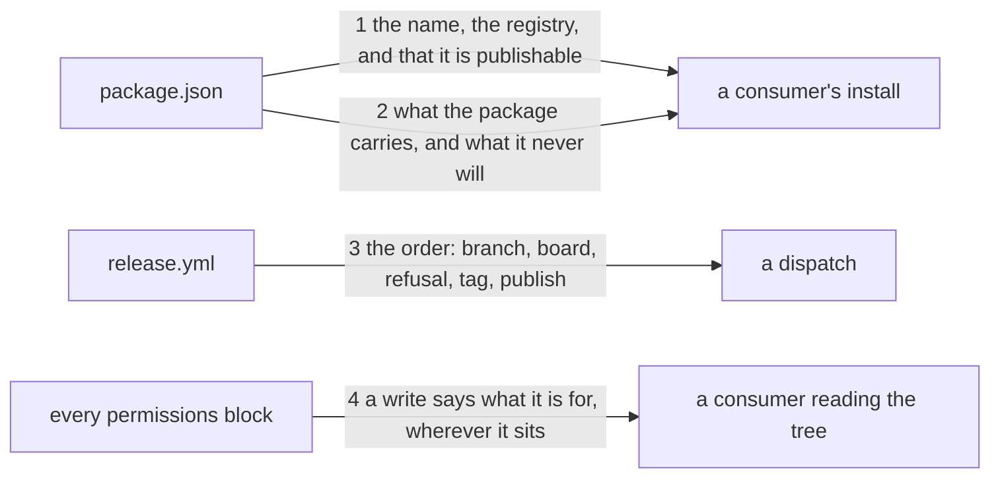

---
traces:
  requirement: the-engine-installs-by-name@7f42be034c0b78b7ebce3c72260082bbb12c3c7040a116a2359a5b22c55d62f7
  principles: the-two-goods@8bbe15706c3edcd63d0d050af9782c063cd585e1ec436d2314fa0003dfaa8cb6
reviews:
  requirement/the-engine-installs-by-name: updated@7f42be034c0b78b7ebce3c72260082bbb12c3c7040a116a2359a5b22c55d62f7 by architect: criterion 2 moved the skills out of the league's working, so seam 2 lists bin, skills and agents and refuses seven directories where it refused six
---

# Drawing: the-engine-installs-by-name

_Written in architect mode from `requirements/the-engine-installs-by-name`,
seven criteria and seven red tests. Read first: `the-release-runs-on-a-key`,
whose workflow this extends and whose drawing established that a step nothing
here can run is read from text and never driven; `security-v1`, whose rule
about a write's reason this task widens and whose acceptance test is where
that rule lives; and `the-tag-installs-offline`, which fixes the install path
that already works and which this must not break._

## What the runs said

- `package.json` reads `"name": "kaal"`, `"private": true`, and declares no
  `publishConfig`. Its `files` is `["bin"]`.
- `security-v1`'s rule is in its acceptance test rather than in a wall
  module, and it matches `^permissions:\n((?:\s+.+\n)*)` at the start of a
  line. Every job level block in the tree is indented, so the rule has never
  read one.
- There is one such block. `codeql.yml` declares `security-events: write`,
  `packages: read` and `actions: read` inside a job, and none of the three
  carries a reason because none of them has ever been read.
- Two top level writes exist and both carry one: `evals.yml` says "the eval
  records it commits, and nothing else" and `release.yml` says "the tag, and
  nothing else".
- `release.yml` runs the branch refusal, `npm ci`, `npm test`, then
  `kaal release`, then the tag. Nothing publishes.
- `the-release-runs-on-a-key`'s drawing recorded that a step needing a token
  and a dispatch cannot be tested here, and that its contract holds the order
  as written rather than as run. Three of its seven criteria were read from
  files that only GitHub executes.

## Structure

One manifest changes, two workflows change, one closed test widens, one skill
and one page gain text. Nothing under `bin/` moves.

- **the manifest** (`package.json`, changes): the name a consumer asks for,
  the `private` flag gone, and the registry declared so a publish cannot
  resolve one from whatever machine runs it. `files` does not move.
- **the release workflow** (`.github/workflows/release.yml`, changes): a
  second write with its reason, and a publish step after the tag.
- **the analysis workflow** (`.github/workflows/codeql.yml`, changes): a
  reason on the write it has always had and nothing has read.
- **the rule** (`requirements/security-v1/acceptance.test.mjs`, changes):
  every write says what it is for, wherever the block is. This is a closed
  test and the change is the supersede the requirement declares.
- **the operate skill** (`skills/operate/SKILL.md`, changes): what changes
  when the artefact is built rather than pointed at, and the record line for
  a visibility no tree can read.
- **the surface page** (`SURFACE.md`, changes): both install paths and which
  one a consumer with a registry takes.

## Seams

1. **The name a registry resolves.** The manifest names `@chbrain/kaal`, is
   not private, and declares its registry. A publish that resolves a
   registry from the machine is a publish that can go somewhere nobody
   chose, and the manifest is the only place a consumer can read where this
   package comes from.
2. **What the package carries.** `npm pack --dry-run` lists `bin/`,
   `skills/`, `agents/`, the licence, the readme and the manifest, and
   nothing from the seven directories that hold the league's own working
   papers, and no file named `.test.mjs`. The skills and the agent are the
   method a consumer installs this for rather than the league's working,
   which `an-install-carries-the-method` settles; they left that list and
   `plan/` and `deploy/` joined it. Removing `private` widens what a mistake
   can publish, and this is still the seam that says it did not: it widened
   deliberately and this says by how much.
3. **The order in the workflow.** The branch refusal, then the board, then
   `kaal release`, then the tag, then the publish. Each step is after the
   last and the publish is after all of them. Read from text, because
   nothing here holds a token.
4. **A write and its reason.** Every `<scope>: write` in every permissions
   block, top level or inside a job, carries a comment on its own line. A
   consumer reading the tree learns what each write is for without reading
   the job that uses it.

## Fixed and free

Fixed:

- The name is `@chbrain/kaal`, `private` is gone, and `publishConfig`
  declares an `https` registry.
- `files` does not change. What the package carries is what it carried
  yesterday, and the test that says so reads `npm pack` rather than the
  manifest, because the manifest is what changed.
- The publish step is after the tag step, and both are after the branch
  refusal, the board and `kaal release`.
- The release workflow declares `packages: write` and its reason, on the
  line, beside the `contents: write` that is already there.
- The rule reads every permissions block, indented or not, and every write
  scope rather than `contents` alone. `read` needs no reason: a read cannot
  change anything and a reason on every line is a page nobody reads.
- `codeql.yml`'s `security-events: write` gains a reason. It is the only
  write in the tree that has never been read by the rule.
- The visibility line is in the release record's shape, and nothing checks
  its value. No tree can read a registry's setting.
- The surface page names both install paths and says which one a consumer
  with a registry takes.

Free:

- The registry's URL, which the asker chooses and the record names.
- The wording of every reason comment beyond having one.
- Whether the publish is a step in the existing job or a job that needs the
  tag, so long as the order holds.
- How the widened rule finds a block: a looser anchor, or a walk of the
  lines. Two shapes of block is not yet three.
- Whether the operate skill's two additions are one paragraph or two.

## Decisions

### The registry is declared in the manifest, not resolved at publish time

- Chosen: `publishConfig.registry` in `package.json`.
- Not taken: an `.npmrc` written by the workflow; the registry passed as a
  flag to `npm publish`; neither, letting the runner's default decide.
- Because: the manifest is the one file a consumer can read before
  installing anything, and a publish that resolves its registry from the
  machine can go somewhere nobody chose. A flag lives in a workflow a
  consumer will not read; an `.npmrc` written at publish time is a file that
  exists only while it matters.
- Bought: keeping the most choices open. Anyone can read where this package
  goes without running anything, and the workflow needs no secret beyond the
  token it already has.
- Spent: the registry is now in a file that ships inside the package, so
  every consumer sees where it was published from whether or not that is
  interesting to them. That is the honest cost of putting it where it can be
  read.
- Weighed against: `the-two-goods`
- Reopens if: the package is ever published to more than one registry, at
  which point the manifest cannot hold the answer and the workflow must.

### The rule widens to every write in every block, and a read still needs no reason

- Chosen: every `<scope>: write`, in a top level block or a job's, carries a
  reason. A `read` carries none.
- Not taken: `contents` alone, which is where the rule is today; every line
  including reads; a list of scopes that must explain themselves.
- Because: the runs found that no job level block has ever been read, so
  `security-events: write` in `codeql.yml` has stood unexplained since it
  was written and nobody noticed. A rule that reads one shape of block is a
  rule that is true about the shape it reads. Reads are excluded because a
  read changes nothing, and a reason on every line is a page a consumer
  scrolls past.
- Bought: the shortest path to a rule that is true about the whole tree
  rather than about its top level.
- Spent: a closed test moves, which is the supersede the requirement
  declares, and one workflow gains a comment for a permission this task did
  not add. That is a task fixing something it did not break, which is
  usually a smell and here is the only way the rule can be honest.
- Weighed against: `the-two-goods`
- Reopens if: a third shape of permissions block appears, at which point the
  rule walks the file rather than matching a block.

### The visibility is a record line and never a check

- Chosen: the release record names the visibility and who set it. Nothing
  reads it.
- Not taken: a check that queries the registry; a manifest field claiming a
  visibility; leaving it unrecorded.
- Because: it is a setting in a registry's own interface and no tree can
  read it. A field claiming a visibility would be a claim nothing verifies,
  which is worse than a record, because a record is honest about being a
  person's word.
- Bought: the shortest path, and a record that says who to ask.
- Spent: the one fact a consumer most wants before depending on this package
  is the one nothing here can prove. The record is a person's word and the
  wall is silent, and that is the whole of what this task can offer.
- Weighed against: `the-two-goods`
- Reopens if: the registry gains a way to read a package's visibility
  without credentials.

### The publish is read from text and proven by a dispatch

- Chosen: seam 3 holds the order as written. No test here runs a publish.
- Not taken: a dry run publish in CI; a fake registry in a test.
- Because: `the-release-runs-on-a-key` settled this for the tag and the same
  argument holds: the half that needs a token and a dispatch cannot be
  proven here, and a test that fakes a registry proves the fake. Three of
  that task's seven criteria were read from files GitHub alone executes, and
  two of this one's are.
- Bought: the shortest path, and no fixture pretending to be a registry.
- Spent: nothing proves a publish works until one happens, and the first
  evidence is a dispatch the asker runs. The order is held; the doing is not.
- Weighed against: `the-two-goods`
- Reopens if: a registry appears that can be run locally without pretending.

## Test strategy

| criterion | layer          | kind          | why                                                                                                   |
| --------- | -------------- | ------------- | ----------------------------------------------------------------------------------------------------- |
| 1         | contract       | deterministic | seam 1: the manifest read as data, each of the three facts asserted on its own                        |
| 2         | contract       | deterministic | seam 2: `npm pack` rather than the manifest, because the manifest is what changed                     |
| 3         | contract       | deterministic | seam 3: the order in the text, which is all that can be held before a dispatch                        |
| 4         | contract, unit | deterministic | seam 4: both shapes of block, and the job level one that has never been read                          |
| 5         | none           | none          | the operate skill's prose, which a person honours and the acceptance test holds                       |
| 6         | none           | none          | a record line for a setting no tree can read; its first evidence is a release record the asker writes |
| 7         | none           | none          | the surface page's text, read by the acceptance test and by a consumer                                |

## Handoff

- Task: the-engine-installs-by-name
- Seams: 4; contract tests: 4 (equal)
- Red run: `node --test --test-timeout=60000 architecture/the-engine-installs-by-name/contracts.test.mjs`, all 4 failing; stand-in green: all 4 passing, discarded
- Criteria served: seam 1 -> 1; seam 2 -> 2; seam 3 -> 3; seam 4 -> 4
- Fixed for the developer: the name, the missing `private`, a declared https
  registry, `files` untouched, the publish after the tag, a second write with
  its reason, a rule reading every block and every write scope but no read,
  a reason on the analysis workflow's write, a visibility line nothing
  checks, and both install paths on the surface page
- Owed with the build: `security-v1`'s acceptance test widened, and the
  supersede recorded on that task's own page
- Unproven, and it is the point: no publish happens here. Two of seven
  criteria are read from files that GitHub alone executes, and the first
  evidence for either is a dispatch. The visibility is a third: it is a
  person's word in a record, and the wall is silent about it on purpose
