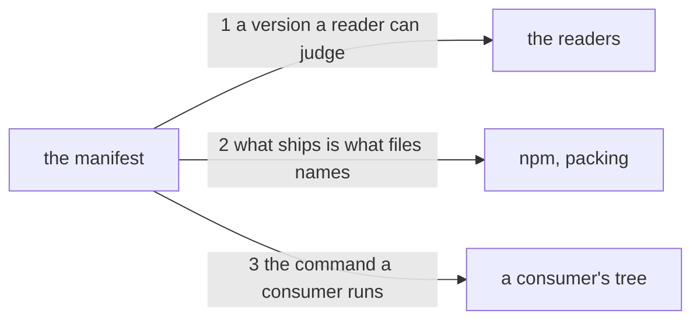

---
traces:
  requirement: the-engine-is-installable@95ec4bb3baeac9088a41a22496e6d07b07bd123a25ec88427ce28ee4169b5397
  principles: nothing
---

# Drawing: the-engine-is-installable

## Structure

Nothing new is built. The only part that changes is the manifest, and it
changes from a file that describes a private working tree into a file that
describes a package.

- **the manifest** (`package.json`, changes): today it says the tree's name,
  its type, its scripts and its one dev dependency. It gains three things a
  reader outside this tree needs: a version, the name of the command the tool
  offers, and the list of what ships.
- **the tool** (`bin/`, unchanged): one entry point with a shebang and a
  library beside it. It resolves one path inside its own package, the league
  root it refuses to write into, and reads the caller's tree for everything
  else, so it already works from a directory that is not this one.
- **the readers** (outside, unchanged): three of them, and they read
  different fields. `npm` reads `files` and `bin` when it packs and installs.
  A consumer reads the command's name. `a-change-declares-its-class`, drawn
  and not yet built, reads the version.
- **the league's working** (`requirements/`, `architecture/`, `retros/`,
  `evals/`, `fixtures/`, `skills/`, unchanged): everything the tree does to
  keep itself honest. None of it ships, and `files` is what says so.

## Seams

1. **a version a reader can judge**: in, the manifest; out, a `version` of
   three numeric places whose minor and major places are both zero. Owned by
   the manifest on one side and by every reader of a version on the other:
   the class wall, a release tag, a consumer's lockfile.
2. **what ships is what files names**: in, the manifest's `files` and `bin`;
   out, every path either field names exists in the tree, and the file `bin`
   points at is inside what `files` ships. Owned by the manifest and by npm's
   packer, which will ship an entry point nobody can run without complaint.
3. **the command a consumer runs**: in, the manifest's `bin`; out, the file
   it names is a program: it starts with a shebang, and run from a directory
   that is not this tree it answers rather than failing on a path it expected
   to find. Owned by the manifest and by the tree the tool is installed into.

## Fixed and free

- Fixed: `private` stays true, so nothing is published (constraint: no
  registry); the first version is `0.0.1` and its minor and major places stay
  zero (criterion 1, and Kai's rule); `bin` maps the name `kaal` and no other
  to `bin/kaal.mjs` (criterion 3); `files` names `bin` and nothing else
  (criterion 2); no `dependencies` key is added (criterion 4); nothing under
  `bin/` changes (constraint).
- Free: where the new fields sit in the manifest and in what order; whether
  `files` is written `"bin"` or `"bin/"`; whether `bin` is written as a map
  or as a bare string, since npm reads both.

## Decisions

### private stays and the git tag is the distribution

- Chosen: keep `private: true` and install from the tag,
  `npm i github:ChBrain/KAAL#v0.0.1`.
- Not taken: dropping `private` and publishing to npm; reserving the name
  `kaal` on the registry now and publishing later.
- Because: a name on a registry is the one part of this that cannot be
  undone quietly, and nothing yet needs it. `private` blocks `npm publish`
  and nothing else: a pack, a tarball install and a git install all work with
  it set, which was checked by running them. So the flag buys a refusal on
  the one irreversible act and costs nothing on the three reversible ones.
- Reopens if: a tree that cannot install from a git URL needs the tool, or
  the skills become packages of their own and want a scope to sit in.

### files names bin and nothing else

- Chosen: an allow list of one entry.
- Not taken: an `.npmignore`, which is a deny list; listing `bin` and
  `skills`, which would ship the skills with the tool.
- Because: a deny list ships whatever nobody remembered to exclude, and this
  tree adds directories often. The skills stay out for a second reason that
  is not size: Kai has said each skill carries its own version and moves on
  its own, which makes a skill an artefact with its own promise, not cargo in
  the tool's tarball. The tool never reads a skill; an agent does.
- Reopens if: the tool grows a runtime file outside `bin/`, at which point
  the list grows with it and seam 2 is what notices.

### prepare stays, and the git install is the online path

- Chosen: leave `prepare` wiring the pre-push hook, and accept that a git
  install runs it.
- Not taken: guarding the command so it does nothing outside this tree;
  moving the hook wiring to an explicit `npm run hooks` that AGENTS.md tells
  a contributor to run.
- Because: npm installs a package's dev dependencies before running its
  `prepare`, so no guard on what the command does removes the cost; only
  having no `prepare` at all would. That trade is a contributor's safety net,
  the hook that runs every wall before a push leaves a machine, against a
  consumer's convenience, and no consumer exists yet while every contributor
  does. The tarball is the offline path and the requirement's offline
  constraint is on the proof, which packs and installs locally and reaches no
  registry.
- Reopens if: a consumer needs an offline git install, at which point the
  wiring moves to a named command and AGENTS.md carries the step.

### the version and the tag are not held equal yet

- Chosen: this task writes the version and nothing checks a tag.
- Not taken: a wall comparing `version` to the most recent tag.
- Because: there is no tag, and a wall over an empty set is green for a
  reason nobody can read. The first release is the human gate already
  declared in `kaal.config.json` and never used, and that is where the two
  first have to agree.
- Reopens if: the first release is cut, which is when a disagreement between
  the version and the tag becomes possible and therefore worth a wall.

## Test strategy

| criterion | layer      | kind          | why                                                                                                                                            |
| --------- | ---------- | ------------- | ---------------------------------------------------------------------------------------------------------------------------------------------- |
| 1         | contract   | deterministic | The version is a string in a file; its shape is decidable by reading it, and the class wall will read it the same way.                         |
| 2         | contract   | deterministic | Whether every path a field names exists is decidable without running npm, and it fails earlier and more legibly than a pack does.              |
| 3         | contract   | deterministic | Whether the entry point runs from a foreign directory is decidable by running it there, which is cheaper than an install and catches the same. |
| 4         | acceptance | deterministic | Nothing below the acceptance layer can see what an install adds; the criterion is about a consumer's tree and only an install answers it.      |

## Handoff

- Task: the-engine-is-installable
- Seams: 3; contract tests: 3 (equal)
- Red run:
  `node --test --test-timeout=60000 architecture/the-engine-is-installable/contracts.test.mjs`;
  all three red, run and read. Each fails on a field the manifest does not
  have: 1 on `version`, 2 on `files` and `bin`, 3 on `bin`.
- Stand-in green: a manifest carrying `version`, `bin` and `files`, all three
  passing, then discarded with `git checkout --`.
- Criteria served: seam 1 serves criterion 1; seam 2 serves criterion 2;
  seam 3 serves criterion 3. Criterion 4 has no seam below the acceptance
  layer and the strategy table says why.
- Fixed for the developer: the four manifest facts under Fixed above. The
  build is one file and adds no test of its own that is not a unit test of
  the manifest, which is a thing the developer should notice before writing
  one: there is no unit here, and the two layers above already hold it.
