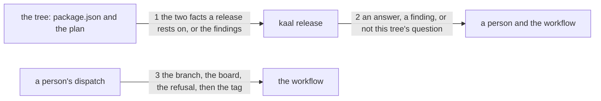

# Drawing: the-release-runs-on-a-key

_Written in architect mode from `requirements/the-release-runs-on-a-key`,
seven criteria and seven red tests, the seventh added after Kai answered an
open question. The closed requirements were read first: `applies-here` and
`nothing-passes-vacuously` fix that a command answers, refuses or says the
question is not its own; `the-tag-installs-offline` fixes what the artefact
is; and `public-v1` fixes that every workflow pins its actions and that
`walls` is the required check._

## What the runs said

- `package.json` carries `0.0.1` and `deploy/releases/0.0.1.md` exists.
  Those are the two facts a release rests on and nothing compares them.
- The v0.0.1 cut was refused twice: once by a credential that writes branch
  refs and not tag refs, once by a board red under a runtime CI did not
  pin. A person finished it from a third machine.
- Ten commands are guarded and a unit asserts the ten by name. Two of the
  ten are asked about the working directory rather than their first
  argument, `runner` because its argument is a skill name and `release`
  because its argument is a version.
- The three workflows in the tree all declare `permissions: contents: read`.
  None of them writes anything today.
- `bin/lib/gates.mjs` runs a command and reads its exit code. Nothing in the
  board runs `release`, and nothing should: between releases every tree
  carries a version whose record does not exist yet.

## Structure

One module is new, one command is added, one module learns a tenth case,
one page and one skill gain text, and one workflow is new.

- **the refusal** (`bin/lib/release.mjs`, new): reads `package.json` and
  looks for the plan. It answers or it finds; it never tags, never pushes
  and never reads the network.
- **the command** (`bin/kaal.mjs`, changes): dispatches `release`, prints
  what comes back and sets the exit code.
- **applicability** (`bin/lib/applies.mjs`, changes): gains a `release` case
  asked about the working directory, and its reason names what the command
  wanted rather than the file it read.
- **the surface page** (`SURFACE.md`, changes): gains a `release` entry.
- **the operate skill** (`skills/operate/SKILL.md`, changes): gains the two
  rules criterion 6 names.
- **the workflow** (`.github/workflows/release.yml`, new): the only part
  that holds a token and the only part nothing here can run.
- **the board** (`kaal.config.json`, unchanged): no wall runs `release`.

## Seams

1. **The two facts, read from the tree.** `checkRelease(root, version)`
   returns the answer or one finding per disagreement: the version the tree
   carries when it is not the one asked for, naming both, and the plan's
   path when there is no plan. It reads two files and nothing else.
2. **The command's answer.** `kaal release <version>` prints what comes back
   and exits 0, 1 or 2. It takes no root and is asked about the working
   directory, because its argument is a version and a version is not a path.
3. **The order in the workflow.** A dispatch is refused unless its ref is
   the default branch; then the board runs; then the refusal; and only then
   is a tag made. Each step is before the next and the tag is after all
   three.

## Fixed and free

Fixed:

- `kaal release <version>` takes no root and is asked about the working
  directory. Adding a root would hand applicability a version string.
- The three exit codes and their meanings.
- That the finding for a version disagreement names both numbers, and the
  finding for a missing plan names the path.
- That `release` is in the guarded table, and that its reason for a foreign
  tree differs from every other command's. Two commands refusing in the
  same words tell a reader nothing, and `class` reads the same file.
- The order in the workflow: the branch, then the board, then the refusal,
  then the tag.
- `permissions: contents: write` and no other write.
- That the module never writes, never runs a command and never reaches the
  network.

Free:

- The wording of the answer and of each finding, beyond the numbers and the
  path the tests require.
- Whether the module reads `package.json` with the runtime's own parser or
  another, and how it joins the plan's path.
- The workflow's job name, its runner and the two git commands' exact form,
  which the release record fixes for a release rather than the drawing.
- Whether the branch refusal is a job condition or a step, so long as it is
  before the board and names the ref.

## Decisions

### The refusal is a module with unit tests; the tag is a workflow with none

- Options: one deploy script that checks and tags, tested end to end; a
  workflow that checks in `if:` conditions and tags; a module that refuses,
  called by a workflow that tags.
- Chosen: a module that refuses, called by a workflow that tags.
- Why: the v0.0.1 record argued that a script wrapping `git tag` and
  `git push` is a wrapper whose tests test the wrapper, and it was right.
  The half worth testing is the two facts; the half that cannot be tested
  here needs a token and a dispatch.
- Bought: keeping the most choices open. The refusal is a command anyone can
  run before a release, in the hook or by hand, and it does not depend on
  the workflow existing.
- Spent: the tag itself is proven by nothing until a dispatch happens. One
  of seven criteria is read from a file rather than driven.
- Reopens if: the release grows an artefact that is built rather than
  pointed at, at which point there is something to test that is not a
  wrapper.

### The version is the argument and the tree is the working directory

- Options: `release <version> [root]`; `release [root] --version <v>`;
  `release <version>`, asked about the working directory.
- Chosen: the third, which is `runner`'s answer.
- Why: applicability is handed the third argument for every command, and a
  version in that position is read as a directory. The first draft did
  exactly that and would have refused every tree.
- Bought: the shortest path, and no change to the front door.
- Spent: the command cannot be pointed at another tree, so a person asking
  about a checkout must be standing in it. That is what the workflow does
  anyway, and it is a real loss for anyone else.
- The gap this widens, and the task that closes it:
  **`an-argument-is-read-once`**, named by `the-board-counts-the-reads`'s
  drawing with the reopen condition "a third command taking a flag". This
  is the third command whose first argument is not a root, so the condition
  has arrived and the task is now owed rather than optional.
- Reopens if: anyone needs to ask about a tree they are not standing in.

### The branch is refused before the board

- Options: refuse after the board, with the rest of the checks; refuse
  first; do not refuse and rely on the person.
- Chosen: refuse first.
- Why: Kai's rule is that every branch is a route towards main, so a
  dispatch from a branch is a category error rather than a near miss. A
  category error should not spend two minutes of CI being told it is well
  made.
- Bought: the shortest path to the answer a person needs.
- Spent: a dispatch from a branch learns nothing about whether that branch
  would have passed. That is the right trade under the rule, and it would be
  the wrong one under a rule where branches are places.
- Reopens if: the routes before main are ever meant to differ in what they
  prove rather than only in where they end.

## Test strategy

| criterion | layer    | kind          | why                                                                                                        |
| --------- | -------- | ------------- | ---------------------------------------------------------------------------------------------------------- |
| 1         | unit     | deterministic | seam 1: the module answers on a tree that agrees, read as data rather than off a printed line              |
| 2         | unit     | deterministic | seam 1: both numbers in the finding, each asserted on its own                                              |
| 3         | unit     | deterministic | seam 1: the plan's path in the finding                                                                     |
| 4         | contract | deterministic | seam 2: the command's three codes, and the guarded table's promise that a foreign tree gets its own reason |
| 5         | none     | none          | seam 3, read from the workflow's text: nothing here runs GitHub, and its first evidence is a dispatch      |
| 6         | none     | none          | the skill's text is prose a person honours; no seam is below it and the acceptance test holds it           |
| 7         | none     | none          | seam 3 again, and the same reason: a condition on a dispatch's ref cannot be driven without a dispatch     |

## Handoff

- Task: the-release-runs-on-a-key
- Seams: 3; contract tests: 3 (equal)
- Red run: `node --test --test-timeout=60000 architecture/the-release-runs-on-a-key/contracts.test.mjs`, all 3 failing; stand-in green: all 3 passing, discarded
- Criteria served: seam 1 -> 1, 2, 3; seam 2 -> 4; seam 3 -> 5, 7
- Fixed for the developer: the command takes no root, the three exit codes,
  both numbers in the version finding and the path in the plan finding, a
  reason unlike every other command's, the order in the workflow, one write
  permission, and a module that writes nothing and runs nothing
- Unproven, and it is the point: three of seven criteria are read from
  files that GitHub executes and nobody else. Seam 3's contract holds the
  order as written, never as run, and the first evidence is a dispatch
