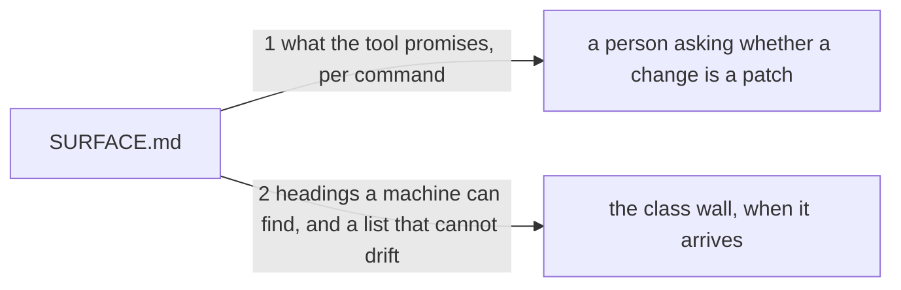

# Drawing: the-surface-is-written-down

_Written in architect mode from `requirements/the-surface-is-written-down`,
four criteria and four red tests. Two of the requirement's open questions
were answered between the filing and this drawing, both by Kai, and both
are closed below as decisions: the class wall will read this page rather
than the usage line, and the page will say nothing about what earns a
minor version. The closed requirements and their tests were read first;
they are the source of every promise the page carries, and they are named
on it. One defect was found and fixed in the analyst's own test: it read
the command list by splitting the usage line on the bar, which breaks
inside `[--write | --check]` and yielded a fragment as a command. A
command is now read as a lowercase word. The human approves by merge._

## Structure

What exists: `bin/kaal.mjs`, whose usage line is the tool's own statement
of what it offers; `README.md`, which tells a reader how to use the tool
and keeps that job; the closed requirements, which fixed each promise one
at a time.

What is new: `SURFACE.md` at the repository root, one section per command,
plus the exit code vocabulary and the shapes a caller parses.

Nothing changes in `bin/`. No command behaves differently after this.

## Seams

1. **what the tool promises, per command**: in, `SURFACE.md`; out, for
   every command the usage line offers, what it answers, what it reads and
   which exit codes it can end on; the vocabulary stated once as three
   codes; and the shapes a caller parses, the applicability line, a
   finding line and the manifest line. Owned by the closed requirements on
   one side, a reader deciding a change's class on the other.
2. **headings a machine can find, and a list that cannot drift**: in, the
   same page; out, one heading per command in a fixed shape, so a wall can
   find a command's section without parsing prose, and a page whose set of
   commands equals the usage line's, tested both ways. Owned by the page
   on one side, the wall that is not written yet on the other.

## Fixed and free

- Fixed: that each command has its own heading, `## <command>`, at the
  same level, with the command as the first word so a machine finds it by
  position and not by search; that the vocabulary appears once and reads
  `0 an answer`, `1 findings or usage`, `2 the question is not this
tree's`; that the page names each promise's closed task; that the page and
  the usage line hold the same set of commands, tested in both directions;
  and that `README.md` keeps the job of telling a reader how to use the
  tool.
- Free: the order of the sections; the wording of what each command
  answers; whether the shapes live in their own section or beside the
  commands that print them; whether the page carries examples.

## Decisions

### The page is an interface, because the wall will read it

- Chosen: one heading per command, `## <command>`, the command first.
- Not taken: a table, which reads well and parses badly across
  formatters; prose naming commands inline, which a wall would have to
  guess at.
- Because: Kai has decided the class wall reads this page rather than the
  usage line, and that makes the page's structure load bearing rather than
  decorative. A wall that parses prose breaks on a rewording, and the day
  it breaks is the day somebody deletes the wall instead of the sentence.
  A heading is the cheapest thing a machine and a person both read.
- Reopens if: the wall ends up reading something else, at which point the
  headings are a convenience rather than a contract.

### The page says nothing about what earns a minor version

- Chosen: silence on 0.1.0, and the question stays open.
- Not taken: writing the rule now, that a surface change earns a minor
  bump, which is what ordinary SemVer would say.
- Because: the surface gained four commands in three days. A rule written
  before the thing it governs has settled is a rule written from
  imagination, and the ordinary rule would make 0.1.0 arrive by accident
  on the next command added rather than as the decision Kai says it is.
  The version stays in its patch place while the surface is still moving,
  and the move to 0.1.0 is a statement that it has stopped.
- Reopens if: the surface goes quiet for long enough that the question can
  be answered from evidence rather than from taste, which is exactly what
  the class wall's record will show.

### Each promise names the task that fixed it

- Chosen: every entry cites the closed requirement that decided it.
- Not taken: conclusions alone, which is shorter and reads cleaner.
- Because: the wall's refusal will send a reader to this page, and the
  first question after "this is not a patch" is "who decided that". One
  hop to the argument is the difference between a rule and a decree, and
  the arguments are already written.
- Reopens if: a promise arrives that no requirement fixed, which would
  mean the surface grew without a task and is a finding of its own.

## Test strategy

| criterion | layer      | kind          | why                                              |
| --------- | ---------- | ------------- | ------------------------------------------------ |
| 1         | contract 1 | deterministic | a section per command, with what it answers      |
| 2         | contract 1 | deterministic | the vocabulary, once, in the words the tool uses |
| 3         | contract 1 | deterministic | the shapes a caller parses, named                |
| 4         | contract 2 | deterministic | the two lists equal, tested in both directions   |

## Handoff

- Task: the-surface-is-written-down
- Seams: 2; contract tests: 2 (equal), beside this file
- Red run:
  `node --test --test-timeout=60000 architecture/the-surface-is-written-down/contracts.test.mjs`;
  both red, run and read. Stand-in green: both, on a scratch `SURFACE.md`,
  discarded
- Criteria served: seam 1 serves 1, 2 and 3; seam 2 serves 4
- Fixed for the developer: the heading shape, the vocabulary's words, the
  citation per promise, and that `README.md` does not change
- Next: the human approves by merge; then `code`
