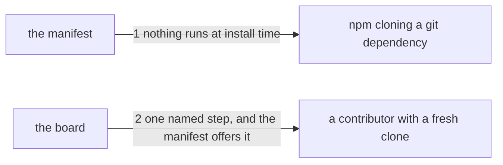

---
traces:
  requirement: the-tag-installs-offline
  principles: nothing
---

# Drawing: the-tag-installs-offline

_Written in architect mode from `requirements/the-tag-installs-offline`,
three criteria, two red and one green as a declared guard. The closed
requirements were read first: `the-engine-is-installable` fixed `files`,
`bin` and the tarball path and its four tests stay green, `push-v1` fixed
that the board in `AGENTS.md` names the steps a contributor runs and that
the hook runs every wall before a push leaves a machine, and
`the-surface-is-written-down` holds the page and the tool equal, which this
task does not disturb because no command changes. The requirement supersedes
one claim of `the-engine-is-installable`'s third decision, and this drawing
is where that decision is actually reversed._

## Structure

Two files change, both of them declarations rather than code.

- **the manifest** (`package.json`, changes): its `scripts` block loses
  `prepare` and gains a named step. Nothing else in it moves: the version,
  `bin`, `files` and `private` are as `the-engine-is-installable` left them.
- **the board** (`AGENTS.md`, changes): the fenced block a contributor reads
  first. Its `npm install` line said it wires the pre-push hook. It stops
  saying so, and a line for the new step says it instead.
- **npm's git install** (outside, unchanged): it clones, prepares and packs.
  Whenever a manifest carries any install-lifecycle script it first runs a
  dev install inside that clone, with `--include=dev`, which needs a
  registry. That is the mechanism and it is not ours to change.
- **the hook** (`.githooks/`, unchanged): what `core.hooksPath` points at,
  and what runs the walls before a push. This task changes when it is wired,
  never what it does.
- **the tarball path** (unchanged): `npm pack` and a tarball install never
  ran an install-lifecycle script under `--ignore-scripts`, and the four
  tests of `the-engine-is-installable` hold it.

## Seams

1. **nothing runs at install time**: in, the manifest's `scripts`; out, none
   of `preinstall`, `install`, `postinstall`, `prepare` or `prepublish` is
   declared, so npm has no reason to run a dev install inside a clone it is
   packing. Owned by the manifest on one side and by npm on the other, and
   the offline install of criteria 1 and 2 is what the promise is for.
2. **one named step, and the manifest offers it**: in, the board's fenced
   block; out, exactly one line whose comment says it wires the pre-push
   hook, whose command is `npm run <name>`, and whose `<name>` is a script
   the manifest declares. Owned by the board and the manifest together: a
   board naming a step nobody can run is worse than a board saying nothing,
   because a contributor believes it.

## Fixed and free

- Fixed: no install-lifecycle script of any name, because the mechanism
  keys on the presence of one and not on what it does (criteria 1 and 2);
  the step is `npm run hooks` and the script is `hooks`, so the board and
  the manifest can be held equal by a name rather than by a command
  (criterion 3); the wiring command itself stays
  `git config core.hooksPath .githooks`, moved and not rewritten; exactly
  one line of the board wires the hook, which the acceptance test already
  counts; `bin/`, `SURFACE.md`, the version and `files` are untouched
  (constraint).
- Free: where the `hooks` script sits among the others; the wording of the
  board's comment beyond the phrase the acceptance test reads; whether the
  `npm install` line keeps a comment at all.

The board's order is a promise. `npm install` comes first because it is
still the first thing a contributor runs, `npm run hooks` follows it because
it depends on the install having happened, and `npm test` stays last because
it is what the other two are for.

## Decisions

### The wiring stops happening at install time, and nothing replaces it there

- Chosen: delete `prepare` and add `hooks` as an ordinary script a person
  runs.
- Not taken: a `postinstall` doing the same thing, which dies the same way
  and was proven to on 7 September; keeping `prepare` and telling every
  consumer to pass `--ignore-scripts`; a `.npmrc` in this tree, which binds
  contributors and not consumers and so fixes nothing.
- Because: npm runs a dev install in the clone whenever any
  install-lifecycle script is declared, whatever it contains. No content
  helps, no name helps, and the run names the line it dies on. So the only
  manifest that installs offline from a git URL is one with no such script.
- Bought: the offline git install, which is the whole task and the one thing
  between this tool and its first dependent. It spends the guarantee that a
  contributor's clone is wired by the act of installing: after this, a
  person who skips the step pushes without the walls, and nothing in the
  tree can notice. That is the price `the-engine-is-installable` declined to
  pay while no consumer existed, and it comes due now.
- Reopens if: npm stops forcing a dev install for a clone it is packing, at
  which case `prepare` can come back and the step retire.

### The board is the only place the step is named

- Chosen: `AGENTS.md`'s fenced block names `npm run hooks`, and the
  acceptance test reads the step off that block rather than carrying it.
- Not taken: a line in `README.md`, which is the door and not the contract;
  both, which is two places to keep true; a printed reminder from some
  command, which is a fourth thing to build.
- Because: the board is what a contributor reads before touching anything,
  by `push-v1`, and the wiring is now a step like the other two. A test that
  reads the step off the board makes the board the thing that has to be
  right, which is the only guarantee left once the automatic wiring is gone.
- Bought: keeping choices open. The command can change later without a test
  changing, because the test reads a name and not a string. It spends a
  little of the shortest path: the board's block is now load bearing for a
  test, and a careless edit to it is a red wall rather than a typo.
- Reopens if: a second contributor step appears that also has to be run
  once, at which point the block wants a shape rather than a convention.

### No wall watches whether the step was run

- Chosen: nothing checks `core.hooksPath` anywhere.
- Not taken: a wall reading the local git config; a hook that installs
  itself on first run of the board.
- Because: the config belongs to a person's machine and not to this tree.
  A wall would be green in CI, which has no hooks and never pushes, and
  green on a contributor's machine only after the thing it was meant to
  guarantee already happened. A wall that cannot fail where it matters is
  worse than an honest gap, because it reads as cover.
- Bought: nothing, and that is the point: this record buys back none of what
  the first decision spent, and says so rather than pretending a wall could.
  It spends the appearance of safety, which was not real.
- Reopens if: git gains a repository-scoped hook path that a clone carries
  with it, which would make the wiring a property of the tree again.

## Test strategy

| criterion | layer      | kind          | why                                                                                                  |
| --------- | ---------- | ------------- | ---------------------------------------------------------------------------------------------------- |
| 1         | contract 1 | deterministic | whether a script is declared is decidable by reading, and it decides the install without running one |
| 2         | contract 1 | deterministic | the same declaration decides both: what runs at install time is what drags the league's working in   |
| 3         | contract 2 | deterministic | the board names a step and the manifest offers it, which is two files agreeing and needs no clone    |

The acceptance tests do the clone and the offline install, which is the only
place that proof can live. The contracts hold the two declarations those
installs depend on, so a failure names the declaration rather than the
network.

## Handoff

- Task: the-tag-installs-offline
- Seams: 2; contract tests: 2 (equal), beside this file
- Red run:
  `node --test --test-timeout=60000 architecture/the-tag-installs-offline/contracts.test.mjs`;
  both red, run and read: `prepare` is declared, and the board's step is
  `npm install`, which is not a script the manifest offers. Stand-in green:
  both, on a scratch manifest and board, discarded with `git checkout --`
- Criteria served: seam 1 serves 1 and 2; seam 2 serves 3
- Fixed for the developer: the words under Fixed above. No unit layer: the
  diff is two declarations and the two layers above are the whole proof.
  The board's block is now read by a test, so a change to it is a change to
  a contract.
- The acceptance tests only go green on a commit. They clone this
  repository and install from the clone, so a working tree that carries the
  fix and has not committed it proves nothing: the clone still holds
  `prepare`, and test 3 goes red as well, because it reads the step off the
  working tree's board and runs it in a clone that has no such script. Both
  contract tests are green at that point, which reads like a build that
  failed and is a build that has not been committed yet. Committing the two
  declarations turns all three green, which was run and read on a stand-in
  commit that was then discarded.
- Next: the human approves by merge; then `code`, then the release gate for
  `v0.0.1`, which is the first use of the `deployment` entry in
  `kaal.config.json`
