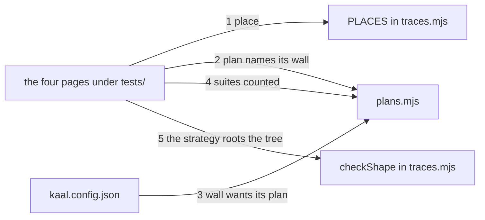

---
traces:
  parent: a-tree-has-one-root@6a481bbf330998342534ce7ba387ab8bc28ba6533ca2491a157ae97b878b7901
  requirement: the-test-tree-is-written-down@ac8c1dd740ac54d37b21875f28d113278f099a6487c8d3249287ec00b393ffe1
  principles: the-two-goods@8bbe15706c3edcd63d0d050af9782c063cd585e1ec436d2314fa0003dfaa8cb6, the-seat-owns-the-lens@e1ab0650fc88dc8e1e16347fc8b14b236f1c57b94e50bfdf3f62aa4ec0d6d070
---

# Drawing: the-test-tree-is-written-down

## What the runs said

- The league holds 111 artefacts and one parent edge. `grep '^  parent: '`
  across all 58 requirements and all 52 drawings returns nothing, and the one
  artefact declaring anything is the trunk, declaring `none`. `kaal traces`
  is green on that tree, because every shape rule bites only on an artefact
  that declared something: `nodes()` sets `isRoot` from an explicit `none`,
  so a tree with no declarations has no root, and the depth rule reads
  `if (!root_ || tree.length < 3) continue`. Requirements and architecture
  are forests today and the wall cannot say so.
- The depth rule fires on the shape this task will build. A scratch root with
  a trunk and four requirements, one declaring `parent: none` with a
  `- Root because:` line and three declaring it as their parent, answers
  `3 of 4 in requirements hang off strategy; that is a star, not a tree`
  and exits 1. Four documents in the ask's shape is a star by the letter of
  the rule.
- `PLACES` in `bin/lib/traces.mjs` holds three entries and `entries()`
  handles two shapes: a directory of directories each holding a named file
  (`requirements`, `architecture`), and a directory of loose `.md` pages
  (`kaal`, whose `file` is null). There is no third shape and no recursion.
  `TREES` holds two names, and only the depth rule reads it; the root, cycle
  and parent rules read `PLACES`.
- A parent cannot resolve inside a loose page place today.
  `KINDS.parent.where` builds `join(from.dir, name, PLACE_FILE[from.dir] ??
"requirement.md")`, and `PLACE_FILE.kaal` is null, so the `??` falls
  through: asked for the trunk's parent it answers
  `kaal/league/requirement.md`, a directory that cannot exist. It has never
  mattered because the trunk is the only loose page and it declares `none`.
  The test tree is the first loose place whose pages point at each other.
- The three test gates in `kaal.config.json` are the only gates whose command
  carries an argument ending in `.test.mjs`:
  `requirements/*/acceptance.test.mjs`,
  `architecture/*/contracts.test.mjs`, and
  `tests/*.test.mjs skills/*/scripts/*.test.mjs`. The other nine name no test
  file at all. The obvious predicate, a `*.test.mjs` glob, matches only the
  third: the star sits in the middle of the other two, and the stand-in was
  red on two fixtures before that showed.
- The globs match 58, 52 and 22 suites. `tests/` holds 21 of the 22 and one
  lives under `skills/analyse/scripts/`.
- `gates.mjs` exports `wallEnv`, `WAIVER_FIELDS`, `readWaiver` and
  `runGates`. It reads `kaal.config.json` inside `runGates` and exports no
  reader, so a second wall wanting the gate list either reads the file or
  changes `gates.mjs`.
- `skills/test/SKILL.md` describes itself as "the one skill every seat loads
  and no seat owns". `kaal/league.md`, merged since, makes the tester a seat
  who "owns the method". The two sentences disagree about whether there is a
  tester, which is a finding this drawing records and does not fix.

## Structure

Four documents, one new module, one row in a table, and one command calling
one more function.

- `tests/strategy.md` is the test tree's root: why the league tests three
  ways, what motivates each, and the rule beneath all of it that code answers
  tests. It declares `parent: none` and carries the argument that a further
  root owes.
- `tests/plans/acceptance.md`, `tests/plans/contracts.md` and
  `tests/plans/units.md` are the three plans, one per wall that runs tests,
  named for the wall each is about. Each declares `parent: strategy`, names
  its wall by the name the board uses, names in backticks the globs its
  suites live under, says how many suites those globs match, and says what a
  case is.
- `PLACES` in `bin/lib/traces.mjs` gains
  `{ dir: "tests", file: null, deep: true }`: the loose page shape the trunk
  already uses, listed through subdirectories so `plans/acceptance` is one
  artefact of the `tests` place and its parent resolves beside the place's
  own root. `TREES` is unchanged. The flag is per place, so `kaal/` keeps
  reading exactly what it reads today.
- `KINDS.parent.where` learns the loose page shape: where a place declares no
  file, a parent is `<dir>/<name>.md` and not `<dir>/<name>/requirement.md`.
  One expression, and it is what makes a place with loose pages a place a
  parent can point inside.
- `bin/lib/plans.mjs` is new: it reads the gate list from `kaal.config.json`
  and the plan pages from the root, and answers three questions, one finding
  shape each.
- `bin/kaal.mjs`'s `traces` command calls `checkTraces`, `checkShape` and
  `checkPlans` in turn, as it already calls the first two.
- `SURFACE.md`'s `traces` entry says the wall now also reads the plans.

## Seams

One labelled edge per seam, numbered to match the list below; the parts are
the structure's parts. The list is the contract; the picture is the reading,
and it carries nothing the list does not.

1. place: in a root, out every `.md` page under `tests/` at any depth as an
   artefact named by its path below the place, and nothing that is not
   `.md`; and in a page's `parent` naming another page of that place, out
   that page's own file and not a directory beneath it. A place is both how
   its artefacts are listed and where a name inside it resolves, and the
   second half has never been exercised. Owned by `PLACES` and
   `KINDS.parent.where` / the pages.
2. plan names its wall: in a plan page's `Wall:` value, backticked or bare
   and wherever in the page it appears, out nothing when the config holds a
   gate of that name, and a finding of kind `plan` naming the page and the
   name it carried when it does not. A page under `tests/plans/` that says
   no wall at all is the same finding with nothing to quote back. Owned by
   `plans.mjs` / the page.
3. wall wants its plan: in the gates whose command carries an argument
   ending in `.test.mjs`, out nothing when exactly one plan is about each,
   and a finding of kind `wall` naming the wall when none is or more than
   one is. The kind is what keeps the two directions apart on the page: a
   plan is usually named for its wall, so `acceptance` the page and
   `acceptance` the wall would otherwise print the same prefix and mean
   different things. Owned by `plans.mjs` / `kaal.config.json`.
4. suites counted: in a plan page's backticked globs and its stated number
   of suites, and the root, out nothing when the globs together match that
   number, and a finding naming the plan, the number stated and the number
   found when they do not; and out the number rewritten when asked to write.
   A page that states no number states no count and is not a finding, which
   is the trace grammar's own rule that a name without a pin resolves. What
   makes the count true of this league is criterion 6, which reads this
   tree's pages and not every tree's. A plan whose globs are not its wall's
   globs is the same finding in different words, naming both. Owned by
   `plans.mjs` / the page.
5. the strategy roots the tree: in the four pages' `parent` values, out one
   root carrying its argument and three children of it, no cycle, and no
   depth finding. Owned by `checkShape` / the pages.

## Fixed and free

- Fixed: `tests/strategy.md`, and one plan per wall under `tests/plans/`
  named for its wall. Criterion 3 fixes both, and decision 1 says why the
  first version of this drawing had them somewhere else.
- Fixed: `tests` joins `PLACES` and does not join `TREES`. Criterion 5 fixes
  the first and decision 2 fixes the second.
- Fixed: which gates owe a plan is read from the config and never declared
  there: a gate owes a plan when its command carries an argument ending in
  `.test.mjs`. Criterion 4 fixes the both ways report and decision 5 fixes
  the predicate.
- Fixed: a plan names its globs in backticks and says how many suites they
  match, in the body and not the frontmatter, and the number is written by a
  flag. Criterion 6 fixes the agreement and the grammar its test reads.
- Fixed: the plan rules live in their own module and `checkTraces` and
  `checkShape` keep the finding lists they return today. Decision 4, and the
  fifty third code retro, which cost four closed contracts to learn it.
- Free: the wording of the strategy and the plans, which is the tester's.
  The board never judges what an argument says, only that it is there.
- Free: whether `plans.mjs` reads the config with `JSON.parse` or a helper,
  and how it globs. Nothing here fixes either.
- Free: the applicability answer is unchanged. A tree with plans and no
  requirements still answers that the traces question is not its own, and
  no criterion here asks otherwise.

## Decisions

### Where the four pages live

- Chosen: `tests/strategy.md`, and one plan per wall under `tests/plans/`,
  named for its wall. The `tests` place is listed through subdirectories, so
  `plans/acceptance` is an artefact of the same place as `strategy` and can
  declare it as its parent.
- Not taken: four flat pages directly under `tests/`, which is what this
  drawing chose the first time and the build put back; a directory of
  directories like `requirements/`; `tests/plans/` as a second place beside
  `tests/`.
- Because: criterion 3 says the plans live under `tests/plans/`, and a
  criterion is the ask. The first version of this drawing read the
  requirement's Assumptions and Open questions and decided the layout on the
  cost of a third shape in `entries()`, which was an architect answering a
  question the analyst had already closed. The third shape is real and it is
  one flag rather than a rewrite: a place says whether it is listed through
  subdirectories, and only the new one is. Two places was the other way to
  avoid the flag, and it costs more than it saves: a parent resolves inside
  its declaring artefact's own place, so a plan in a second place could not
  name the strategy at all, and the tree would have two roots to argue for
  instead of one.
- Bought: the shortest path, and it spent parts. There is now a per place
  flag that exactly one place sets.
- Weighed against: the-two-goods.
- Reopens if: a second place wants the same listing, at which point the flag
  is the default and the trunk is the exception.

### The test tree is a place and not a tree the depth rule reads

- Chosen: `PLACES` gains `tests`; `TREES` does not.
- Not taken: adding `tests` to `TREES` and raising the depth rule's size
  guard past four; adding it and accepting a red board; leaving the pages
  out of `PLACES` altogether.
- Because: the depth rule asks whether a tree is hiding a middle layer. The
  requirements and architecture trees gain a node per task and their shape is
  chosen every time, so the question is real there. The test tree gains a
  node only when a wall is added, and its shape is not chosen: the ask fixed
  it as a strategy above plans, with suites and cases below as files rather
  than documents. A rule that no honest shape of this tree can satisfy is a
  rule that would only ever be waived. The root, cycle and parent rules all
  read `PLACES` and so all still apply, which is the part of the shape that
  is global.
- Bought: keeping choices open, and it spent the shortest path to a uniform
  rule. There are now two kinds of tree in the wall's reading and a reader
  has to know which is which.
- Weighed against: the-two-goods, the-seat-owns-the-lens.
- Reopens if: the test tree gains documents below the plans, or a plan gains
  sub plans, or the other two trees start declaring parents. The last is the
  sharpest: the depth rule has never read a real tree, and once it does, an
  exemption written while it read nothing is owed a fresh argument.

### A plan's suite count is written, not kept

- Chosen: a plan names its globs in backticks and states how many suites
  they match, in prose; `--write` rewrites the number as it rewrites a
  trace's shas.
- Not taken: no count, with the board reporting what the globs matched; a
  count kept by hand; a pin on the glob itself, `<glob>@<n>`, which is what
  this drawing chose the first time.
- Because: criterion 6 asks the plan's count to agree with what its glob
  matches, so the count is in the page, and its acceptance test reads a
  backticked glob and a number before the word suites. The analyst's own
  fixtures settled the rest of the grammar and the drawing had guessed it
  wrong twice: a wall is named `Wall:` in a sentence and not only as a
  field, and a plan that states no number is silent rather than a finding. That is the grammar,
  and inventing a second one with an `@` in it would have been the drawing
  overruling the proof. What survives from the first version is the reason:
  a count kept by hand costs an edit to a plan on every task that adds a
  suite, and a number nobody can afford to update teaches a reader to
  ignore the page, so the flag writes it and the cost is a command run that
  every task already makes.
- Bought: evidence, and it spent parts. There is a second thing `--write`
  writes, and it writes prose rather than a field.
- Weighed against: the-two-goods.
- Reopens if: writing pins stops being a step every task already takes, or
  the count starts disagreeing for a reason other than a suite landing.

### The plan rules are their own module

- Chosen: `bin/lib/plans.mjs` exporting `checkPlans(root)`, called by
  `bin/kaal.mjs` after `checkShape`.
- Not taken: a function inside `traces.mjs`; folding the rules into
  `checkTraces`; a thirteenth wall.
- Because: the last build folded the shape rules into `checkTraces` and
  changed what every caller of that function means by a finding, which
  turned four closed contracts red at once for a design error in one line.
  A separate module cannot do that. The constraint forbids a thirteenth
  wall and the trace command is the right one: a plan naming a wall is a
  name that must resolve, which is that wall's whole question.
- Bought: keeping choices open, and it spent the shortest path. Three
  functions called in turn is more to read than one.
- Weighed against: the-two-goods.
- Reopens if: a fourth question about the same pages appears, at which point
  the command is calling four functions and the grouping wants rethinking.

### Which gates owe a plan is read, not declared

- Chosen: a gate owes a plan when its command carries an argument ending in
  `.test.mjs`, and its suites are those arguments.
- Not taken: a `plan` field on the gate in `kaal.config.json`; a hardcoded
  list of the three names; every gate owing a plan.
- Because: a field in the config would make the criterion true by
  declaration, so removing the field would make the wall silent rather than
  red, and a check that can be switched off by the thing it checks is not a
  check. A hardcoded list of three is the same snapshot mistake the reason
  rule made about `contents: write` last week. Reading the command means a
  fourth wall that runs tests owes a plan the day it is added and nobody has
  to remember. Every gate owing a plan was the last option, and the ask
  settled it: everything goes through the chain from requirements to
  operations, so the nine other walls were each built through that chain and
  are already held by all three plans. They are things the plans test, not a
  fourth kind of testing.
- Bought: evidence, and it spent options. A future test wall whose command
  does not name a `.test.mjs` glob would be missed, and the rule would need
  widening rather than a field flipping.
- Reopens if: a wall runs tests without naming a file ending in
  `.test.mjs`, or a gate names such a file for a reason other than running
  it.
- Weighed against: the-two-goods.

## Test strategy

| criterion | layer      | kind          | why                                                                                                                               |
| --------- | ---------- | ------------- | --------------------------------------------------------------------------------------------------------------------------------- |
| 1         | acceptance | deterministic | The strategy naming three plans and what motivates each is prose in a page; a test reads the page and no seam carries it.         |
| 2         | acceptance | deterministic | The same: a sentence the strategy must hold, read from the page.                                                                  |
| 3         | contract   | deterministic | Seam 2. A plan page's declared wall is read, and a plan naming nothing the config holds is a finding.                             |
| 4         | contract   | deterministic | Seams 2 and 3, kept apart on purpose: one finding names the plan and the other names the wall.                                    |
| 5         | contract   | deterministic | Seam 1. A page under `tests/` is an artefact the trace wall reads, or it is not, and a fixture says which.                        |
| 6         | contract   | deterministic | Seam 4 for the counts, seam 3 for the three and three; the board's answer on this tree is the acceptance test.                    |
| none      | unit       | none          | Every rule here is a seam between a page and the config, and a unit test of one would be the contract test with the seam removed. |
| none      | manual     | none          | Nothing here needs a person to look. The one judgement, whether a root's argument is any good, the board never reads.             |

## Handoff

- Task: the-test-tree-is-written-down
- Seams: 5; contract tests: 5 (equal)
- Red run: `node --test architecture/the-test-tree-is-written-down/contracts.test.mjs`,
  all five failing. Stand-in green: all five, on a scratch `plans.mjs` with
  `tests` in `PLACES`, the loose place branch in `KINDS.parent.where` and the
  third call in the command, then discarded from file copies
- Isolations: eight, one break at a time, and seven of the eight reddened
  exactly one seam. The eighth, resolving a parent in a loose place beneath
  the page, reddened seams 1 and 5 together, and that is the seams telling
  the truth: a shape whose parents do not resolve is not a rooted tree
- Fixtures: nine roots, one shape each, so no finding is reported in
  another's words: `reads`, `plan-names-nothing`, `plan-names-no-wall`,
  `wall-has-no-plan`, `two-plans-one-wall`, `count-wrong`, `wrong-suites`,
  `the-shape`, and `root-unargued`
- Criteria served: seam 1 -> 5; seam 2 -> 3, 4; seam 3 -> 4, 6; seam 4 -> 6;
  seam 5 -> 5. Criteria 1 and 2 are prose and are served by the acceptance
  tests alone, which the strategy table says in full
- Fixed for the developer: a parent inside a loose page place resolves to
  `<dir>/<name>.md`; the four pages' place and shape; `tests` in
  `PLACES` and not in `TREES`; the `- Wall:` and `- Suites:` lines and the
  pin grammar; the three findings and which name a plan and which a wall;
  `plans.mjs` as its own module; the `.test.mjs` glob as what makes a gate
  owe a plan
- Found and not fixed: 111 artefacts in this league and one parent edge. The
  trees the ask calls trees are forests, and the wall that would say so is
  green because every rule bites only on a declaration nobody has made. This
  task builds the first tree that declares any, which is why the depth rule
  fires here first and nowhere else. Whether the other two trees are made to
  declare theirs is a task, not a line
- Read as a disagreement and it is not one, which the asker corrected while
  this was being built. `skills/test/SKILL.md` says the test skill is loaded
  by every seat and owned by none; `kaal/league.md` says the tester is a seat
  that owns the method. Those are two different nouns. The skill is the
  discipline of the proof and the analyst, the architect and the developer
  all load it; the seat is who owns the method and argues about it. The skill
  already draws the line this task needed: its output "is the proof half of
  whichever seat loaded it, and lands in that seat's lane". The seat decides
  where a result goes, never the skill, which is why the cases live with what
  they test and only the strategy and the plans live here
