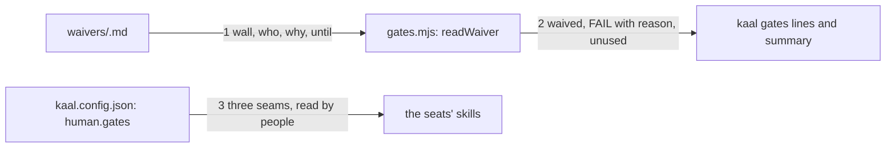

# Drawing: waiver-v1

_Written in architect mode from `requirements/waiver-v1`, five criteria,
five red tests. The human approves by merge._

## Structure

What exists: `bin/lib/gates.mjs` (`runGates`, `wallEnv`), the runner's
line and summary formats, `kaal.config.json` with `gates` and `standard`.

What is new:

- **`human.gates`** in `kaal.config.json`: three entries, `requirements`
  (the human sets the ask; evidence, the ask itself; recorded, the
  requirement), `architecture` (approves the drawing; evidence, the drawing
  and its red contracts; recorded, the merge of its pull request),
  `deployment` (gives the key; evidence, a green board and a release plan;
  recorded, the release record).
- **`waivers/`** with a README saying the shape: `waivers/<wall>.md`, four
  frontmatter fields `wall`, `who`, `why`, `until`; one per wall; a waiver
  is a human's act and lives in history.
- **`readWaiver(root, wall)`** in `gates.mjs`: returns the waiver's fields,
  or a reason it counts for nothing (`missing <field>`, `expired <date>`,
  `names another wall`). `runGates` consults it for every failing wall and
  for every green wall with a waiver file, so an unused waiver is reported.
- **The line and summary formats**: `waived <wall> by <who>: <why> (until
<date>)`; `FAIL <wall> ... [waiver <reason>]` when a waiver exists but
  counts for nothing; `unused waiver <wall>` for a green wall; the summary
  `<green|red>: N wall(s), F failing, W waived`.

What changes: `gates.mjs`, `kaal.config.json`, `README.md` (one clause),
the pre-push hook's comment (a waiver is the way past a red wall, never
`--no-verify`).

## Seams

1. **waiver file to runner**: in, the file for a wall; out, its fields or
   the reason it counts for nothing. Owned by the human who wrote it on one
   side, `gates.mjs` on the other.
2. **runner to shell**: in, the results with waivers applied; out, the
   lines and the summary in the formats above, exit 0 when nothing fails
   unwaived. Owned by the runner on one side, the hook and CI on the other.
3. **config to the seats**: in, `human.gates`; out, nothing computed in v1:
   the entries are read by people and by the skills' text, which name the
   same three seams. A contract test holds the config's seams equal to the
   seams the design names.

## Fixed and free

- Fixed: the three seams and their fields (criterion 1); the waiver's four
  fields and location (criteria 2 to 4); the `waived` line opener and the
  three summary counts (criteria 2, 5); an expired or incomplete waiver
  counts for nothing and the reason is printed.
- Free: the wording after `waived`; whether `readWaiver` caches; the README
  text in `waivers/`.

## Decisions

### A waiver never hides a red

- Chosen: the wall still runs and its result is printed; the line says
  `waived`, not `ok`, and the summary counts it.
- Not taken: skipping the wall; printing `ok`.
- Because: a waiver is a human saying "I know, and here is why, until this
  day"; the board must keep saying what the wall said.
- Reopens if: never.

### An unused waiver is reported and not failed

- Chosen: `unused waiver <wall>` on a green wall.
- Not taken: failing the run; silence.
- Because: a waiver that outlived its reason is a claim to clean up, not a
  broken tree; silence would let it sit forever.
- Reopens if: unused waivers accumulate; then a wall for them.

## Test strategy

| criterion | layer      | kind          | why                                |
| --------- | ---------- | ------------- | ---------------------------------- |
| 1         | contract 3 | deterministic | seams equal in config and design   |
| 2, 3, 4   | contract 1 | deterministic | exit codes and reasons on fixtures |
| 5         | contract 2 | deterministic | the summary line                   |

## Handoff

- Task: waiver-v1
- Seams: 3; contract tests: 3 (equal), beside this file; fixture `unused`
  here, the rest under the requirement
- Red run: all three failing; stand-in green in scratch
- Criteria served: seam 1 serves 2, 3, 4; seam 2 serves 2, 5; seam 3
  serves 1
- Next: the human approves by merge; then `code`
