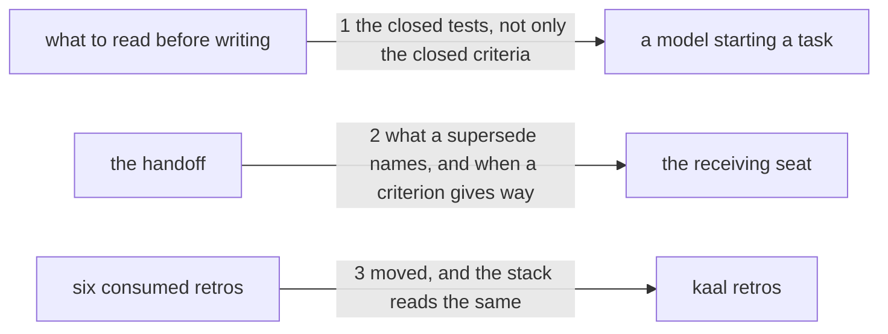

---
traces:
  requirement: what-a-closed-task-fixes@1de5fbfacc6c3111c5b1b9d5289ea66a85183fd95999aa55f41e1f1de6682e5b
  principles: nothing
---

# Drawing: what-a-closed-task-fixes

_Written in architect mode from `requirements/what-a-closed-task-fixes`,
three criteria and three red tests. Drawn beside
`red-for-the-right-reason` from the same analyst run; the two edit
different sections of one file and land in one pull request. The closed
requirements and their tests were read first, which is the habit this task
is about: `analyse-v2` and `analyse-v3` fix the numbered sections and the
handoff's fields, and the `- Supersedes:` line already exists there with
nothing said about what belongs in it. The human approves by merge._

## Structure

What exists: `skills/analyse/SKILL.md`, whose `## 1. Read the ask, and
count it` says what to do before writing anything, and whose
`## 5. Hand off` lists the handoff's fields including `- Supersedes:`.

What changes: a paragraph in section 1 on reading the closed work; a
sentence in section 5 on what a supersede names; six files moved from
`retros/` to `retros/archive/`. `RUNNER.md` regenerated.

Nothing is new and nothing in `bin/` changes. The analyse skill does not
today mention closed requirements at all: the architect skill does, and
this brings the analyst's half of it.

## Seams

1. **the closed tests, not only the closed criteria**: in, `## 1. Read the
ask, and count it`; out, that the closed requirements whose paths the
   task touches are read with their tests as well as their criteria,
   because a closed test fixes shapes no criterion states. The contract
   reads that section: a rule about what to read before writing, placed
   after the writing has begun, is a rule met too late.
2. **what a supersede names, and when a criterion gives way**: in,
   `## 5. Hand off`; out, that a supersede names the closed task, the
   exact claim that moves and the principle that permits it, and that
   where the closed task's own principle pushes the other way it is the
   new criterion that gives way instead. The contract reads that section
   and leaves the existing sentence about `- Supersedes:` in place.
3. **moved, and the stack reads the same**: in, six retro files; out, each
   under `retros/archive/` and none under `retros/`, and `kaal retros`
   reporting the same counts as before, since a retro is consumed when a
   requirement names it and not when it moves.

## Fixed and free

- Fixed: that the reading rule is inside section 1 and the supersede rule
  inside section 5; the phrases the tests read (`their tests as well as
their criteria`, `fixes shapes no criterion states`, `the exact claim that
moves`, `the principle that permits it`, `pushes the other way`, `your
criterion gives way`); that the six files move rather than being deleted;
  and the regenerated `RUNNER.md`.
- Free: the wording beyond those phrases; whether section 1 gains a
  paragraph or a bullet; whether the supersede sentence sits beside the
  `- Supersedes:` field or after the list.

## Decisions

### Both rules are placed where they are met, not where they are about

- Chosen: reading the closed work in section 1, superseding in section 5.
- Not taken: putting both in section 5, where `- Supersedes:` already
  lives, which reads tidily as one subject.
- Because: they are met at different moments. Reading the closed tests is
  something you do before the first criterion exists; deciding what a
  supersede names is something you do when the handoff is written. A rule
  a model meets after it has already written the criteria has cost the
  work it was meant to save.
- Reopens if: section 1 grows past a page, where a reader stops reading
  and starts skimming.

### The rule says which way gives way, and on what test

- Chosen: the sentence carries both halves, the supersede and the giving
  way, and names the test between them: the closed task's own stated
  principle.
- Not taken: saying only what a supersede names, leaving the choice
  between superseding and giving way to judgement.
- Because: without the test, "supersede" is a licence. Both cases
  happened here within a day, decided on exactly that principle, and a
  reader who has only one half of the rule will take whichever half suits
  the change in front of them.
- Reopens if: a case arrives where neither task's principle covers it,
  which would need a third answer rather than a sharper test.

## Test strategy

| criterion | layer      | kind          | why                                                          |
| --------- | ---------- | ------------- | ------------------------------------------------------------ |
| 1         | contract 1 | deterministic | the rule, inside the section where it is met                 |
| 2         | contract 2 | deterministic | both halves and the test between them, in the handoff        |
| 3         | contract 3 | deterministic | archived, gone from the stack, counts unchanged              |
| 1, 2      | eval       | harnessed     | whether a model reads the closed tests; reports, never gates |

## Handoff

- Task: what-a-closed-task-fixes
- Seams: 3; contract tests: 3 (equal), beside this file
- Red run:
  `node --test --test-timeout=60000 architecture/what-a-closed-task-fixes/contracts.test.mjs`;
  all three red. Stand-in green: all three, on a scratch edit of the skill
  and a copy of the six files, discarded
- Criteria served: seam 1 serves 1; seam 2 serves 2; seam 3 serves 3
- Fixed for the developer: the two sections, the six phrases, that the
  files move rather than being deleted, and the regenerated `RUNNER.md`
- Next: the human approves by merge; then `code`
