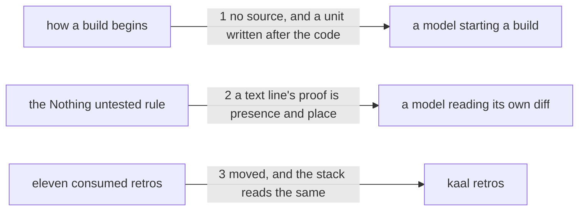

# Drawing: what-proves-a-build

_Written in architect mode from `requirements/what-proves-a-build`, four
criteria and four red tests, the third drawing of one run. The closed
requirements and their tests were read first: `code-v2` fixes this skill's
numbered sections and the **Nothing untested** bullet, whose sentence the
tests below assert survives. No fixture of the code skill carries a
runner. The human approves by merge._

## Structure

What exists: `skills/code/SKILL.md`, whose `## 1. Read what is fixed, then
start red` says how a build begins, and whose `## 3. Build to the proof`
carries the rules a build must meet, including **Nothing untested**, which
says every line in the diff is there because a test needs it.

What changes: section 1, which gains the case where there is no source and
the rule for a unit written after the code; the **Nothing untested**
bullet, which gains what a text line's proof actually is; and eleven retro
files moved to `retros/archive/`.

Nothing is new and nothing in `bin/` changes.

## Seams

1. **no source, and a unit written after the code**: in, `## 1. Read what
is fixed, then start red`; out, that a build whose diff is text and not
   source has no unit layer, that the contract and acceptance tests are
   then the whole proof, and that the task closes on the layers that exist
   with the handoff naming which runs were made; and that a unit test
   written after the code has not been seen red, so it is trusted only
   once the thing it tests has been broken and watched to fail, with the
   warning that a test of an ordering can pass whatever the code does when
   the order came from the environment rather than the code. Both belong
   where a build begins, because both decide what the developer does
   first.
2. **a text line's proof is presence and place**: in, the **Nothing
   untested** bullet of `## 3. Build to the proof`; out, that a text
   line's proof is its presence and its place, held by the tests the seats
   above wrote, and never its meaning. The contract reads that bullet and
   asserts its existing sentence is still there, since `code-v2` fixed it.
3. **moved, and the stack reads the same**: in, eleven retro files; out,
   each under `retros/archive/`, none under `retros/`, counts unchanged.
   The third wording of one promise in this run, which is the known
   duplication.

## Fixed and free

- Fixed: that the no-source case and the break-it rule are in section 1
  and the proof-of-a-text-line in the **Nothing untested** bullet; the
  phrases the tests read (`text and not source`, `no unit layer`, `the
layers that exist`, `has not been seen red`, `broken and watched to fail`,
  `came from the environment rather than the code`, `its presence and its
place`, `never its meaning`); that **Nothing untested** keeps the sentence
  `code-v2` fixed; and that the eleven files move rather than being
  deleted.
- Free: whether section 1 gains one paragraph or two; the wording beyond
  those phrases; the order of the moved files.

## Decisions

### The no-source case is written where a build begins, not where it ends

- Chosen: `## 1. Read what is fixed, then start red`.
- Not taken: `## 5. Hand off`, where the task is closed and the runs are
  named, which is where the consequence shows.
- Because: the developer needs to know there is no unit layer before
  looking for something to unit test, not after writing the handoff. The
  consequence at handoff follows from the case, and a rule read at the end
  has already cost the search it was meant to save.
- Reopens if: the handoff grows its own list of what a build must name, at
  which point the closing half moves there and the case stays here.

### The rule is an exception, and it does not loosen the rule it excepts

- Chosen: the text says a build whose diff is text has no unit layer, and
  leaves untouched that a unit test comes first where there is source.
- Not taken: softening **Nothing untested** into something a text build
  can satisfy, or letting the developer decide which builds need units.
- Because: four builds in two days had no source, and every one of them
  was text in a skill file. That is a case, not a licence, and a rule that
  let a developer decide would turn the hardest builds into the ones with
  no units at all.
- Reopens if: a build appears whose diff is neither text nor source, which
  would be a third case rather than a widening of this one.

## Test strategy

| criterion | layer      | kind          | why                                                       |
| --------- | ---------- | ------------- | --------------------------------------------------------- |
| 1         | contract 1 | deterministic | the no-source case, where a build begins                  |
| 3         | contract 1 | deterministic | the break-it rule, in the same place                      |
| 2         | contract 2 | deterministic | the proof of a text line, in the rule it qualifies        |
| 4         | contract 3 | deterministic | archived, gone from the stack, counts unchanged           |
| 1, 3      | eval       | harnessed     | whether a model breaks its own code; reports, never gates |

## Handoff

- Task: what-proves-a-build
- Seams: 3; contract tests: 3 (equal), beside this file
- Red run:
  `node --test --test-timeout=60000 architecture/what-proves-a-build/contracts.test.mjs`;
  all three red, run and read. Stand-in green: all three, on a scratch edit
  of the skill and a copy of the eleven files, discarded
- Criteria served: seam 1 serves 1 and 3; seam 2 serves 2; seam 3 serves 4
- Fixed for the developer: the two places, the eight phrases, the
  untouched **Nothing untested** sentence, and that the files move
- Next: the human approves by merge; then `code`
