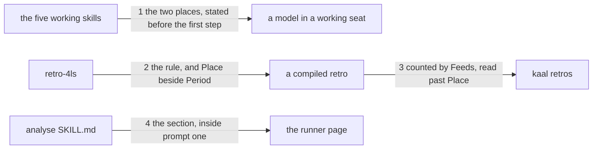

# Drawing: where-a-skill-acts

_Written in architect mode from `requirements/where-a-skill-acts`, four
criteria and four red tests. The change is text: six skill files, no new
module and no flag, because a skill can only be told by its own text. The
closed requirements that touch these paths were read first. skills-v1 and
standard-v2 fix the shape of a SKILL.md and its budget, and a new section
of eight lines sits inside both. eval-runner fixes that the runner is
generated from the tree, which is why the analyse fixture's `RUNNER.md`
moves in this build and not later. nothing-stale fixes that a record says
its three shas, so the analyse eval records go stale the moment this
lands, honestly and by design; no wall reads them. The human approves by
merge._

## Structure

What exists: six skills under `skills/`, each a `SKILL.md` a model reads
top to bottom; three readers of that text besides the model, which are
`kaal check` (the rules), `kaal runner` (the eval prompts), and
`bin/lib/retros.mjs` (the stack, which reads what a retro compiles to).

What changes:

- **the five working skills** (`analyse`, `architect`, `code`, `operate`,
  `test`): one new section, `## Where you act`, in the same place in each,
  after the opening prose and before the first numbered step.
- **`retro-4ls`**: two edits, both where the skill already speaks about
  filing. `## Feed the loop` gains the rule that the retro lands in the
  league either way and names the kind of place. `## Output format` gains
  a `Place:` line under the `Period:` line it already carries.
- **`skills/analyse/fixtures/json-flag/RUNNER.md`**: regenerated, because
  prompt one is the whole skill and the skill moved.

What is new: `fixtures/place-line/`, a root with two skill directories and
one filed retro carrying the new line, so the stack can be driven from
outside.

Nothing is added to `bin/`. The place is a fact the ask carries, not a
switch, and no wall reads the new sentences except through the contract
tests below.

## Seams

1. **the two places, stated before the first step**: in, the five working
   `SKILL.md` files; out, one section headed `## Where you act`, in every
   one of them, standing before that skill's `## 1.`, and carrying both
   sentences: that a skill acts in the repository that holds its work or a
   directory you were pointed at, that the ask names which and a skill not
   told asks before you begin; and that in a directory you were pointed at
   you write nothing there, you hand the output over and ask where the
   work lands. Owned by the five skills' text on one side, the model that
   reads them on the other.
2. **the rule, and Place beside Period**: in, `retro-4ls`; out, in
   `## Feed the loop`, that the retro is filed in the league either way
   because it is about the application of the skill and not about the tree
   it was applied to, and that it names the kind of place and never the
   tree; and in `## Output format`, a `Place:` line on the line under
   `Period:`, naming the two kinds. Owned by the retro skill on one side,
   every compiled retro on the other.
3. **counted by Feeds, read past Place**: in, a root holding skill
   directories and a filed retro that carries a `Place:` line; out,
   `kaal retros` counts that retro for the skill its `Feeds:` line names
   and is untouched by the new line. Owned by the retro's text on one
   side, `bin/lib/retros.mjs` on the other.
4. **the section, inside prompt one**: in, the analyse skill and its
   `json-flag` fixture; out, `kaal runner analyse json-flag` renders a
   prompt one that carries the `## Where you act` heading, and
   `kaal runner --check` finds every `RUNNER.md` current. Owned by the
   skill text on one side, the runner page a model is handed on the other.

## Fixed and free

- Fixed: the heading `## Where you act`, spelled the same in all five, and
  its place before the first numbered step (criterion 1 says a skill not
  told asks _before it begins_, and a rule a model meets after step three
  is a rule it meets too late). The words the contracts read: `repository
that holds`, `directory you were pointed at`, `the ask names which`, `ask
before you begin`, `you write nothing there`, `ask where the work
lands`, and in the retro skill `filed in the league either way`,
  `application of the skill`, `not about the tree`, `never the tree`. The
  `Place:` line's key and its position directly under `Period:`. That
  `Feeds:` stays the only line the stack parses.
- Free: every other word of the six edits, including how the two kinds are
  phrased inside the `Place:` brackets so long as `pointed at` is in them;
  whether the working skills' section is one paragraph or two; whether the
  retro rule is a new paragraph in `## Feed the loop` or joins one that is
  there; the fixture's file names under `fixtures/place-line/`.

## Decisions

### The section stands before the first step, not inside Scope

- Chosen: an unnumbered `## Where you act` between the opening prose and
  `## 1.`, in all five.
- Not taken: a paragraph inside each skill's `## 4. Scope`; a new numbered
  step 0; five different headings, each in that skill's own voice.
- Because: the criterion says a skill not told asks before it begins, and
  where a rule sits is when a model reads it. Scope answers what a seat
  may do, which is a different question, and a reader looking for the
  place would not look there. One heading, spelled the same, also makes
  the rule countable: a sixth working skill that arrives without the
  section is one grep from being found, and the contract is that grep.
- Reopens if: a skill grows a preamble of its own that has to come first;
  then the section moves under it and the contract reads the new order.

### `retro-4ls` does not get the section

- Chosen: the retro skill carries its rule in `## Feed the loop`, where it
  already says where a retro goes, and nothing else moves.
- Not taken: giving all six skills the same section, for symmetry.
- Because: the retro's place is not a choice the ask makes. It is always
  the league, which is the whole point of criterion 3, and a section
  headed "where you act" offering two places would say the opposite of
  what that skill needs to say. Symmetry that contradicts the rule is
  decoration.
- Reopens if: the open question about where the work lands is answered in
  a way that gives the retro a second home; then it needs the section the
  others have.

### `Place:` is written, not parsed

- Chosen: the line is prose in the compiled retro; `Feeds:` stays the only
  line `bin/lib/retros.mjs` reads, and the contract fixes that.
- Not taken: teaching the retro reader a `Place:` field, so a stack could
  be counted by place, which is the requirement's fourth open question.
- Because: a field a wall parses is a promise about a vocabulary, and the
  vocabulary follows the answer Kai has open on where the work lands. I
  would be freezing the second half of a sentence whose first half is not
  written. Prose costs nothing to change; a parsed field costs a
  migration of sixty files.
- Reopens if: an analyst run wants the stack counted by place, or a retro
  says the line is being written wrong often enough to need a wall.

### The runner carries the section by construction

- Chosen: nothing is added to the runner. Prompt one is the whole
  `SKILL.md`, so the section is in it, and the contract reads the rendered
  page to prove it rather than trusting that.
- Not taken: a line in the runner's framing telling a model its place,
  which is the requirement's third open question.
- Because: two statements of one rule drift, and the framing is shared by
  every skill and every fixture while the rule is the skill's. The eval
  ask that comes with a runner page is the whole world a model has there,
  so a model that follows the new text will ask which place it is in, and
  that is the skill working, not the runner failing.
- Reopens if: the runner ever renders less than the whole skill, or an
  eval shows models asking the place question in a way the checklist
  cannot read.

## Test strategy

| criterion | layer      | kind          | why                                                     |
| --------- | ---------- | ------------- | ------------------------------------------------------- |
| 1         | contract 1 | deterministic | the heading, its place before step one, its words       |
| 2         | contract 1 | deterministic | the guest sentences live in that same section           |
| 3         | contract 2 | deterministic | the rule, read where the skill speaks of filing         |
| 4         | contract 2 | deterministic | Place directly under Period in the fenced block         |
| 3         | contract 3 | deterministic | the stack counts by Feeds and reads past the line       |
| 1, 2      | contract 4 | deterministic | what a model reads is the rendered prompt, not the file |
| 1, 2      | eval       | harnessed     | whether a model told nothing asks; reports, never gates |

## Handoff

- Task: where-a-skill-acts
- Seams: 4; contract tests: 4 (equal), beside this file; fixture root
  `fixtures/place-line/` here
- Red run:
  `node --test --test-timeout=60000 architecture/where-a-skill-acts/contracts.test.mjs`;
  three red (1, 2, 4). Contract 3 is green before the build and is meant
  to be: it is the guard on a reader six seats share, and it says what
  must not change. Stand-in green: all four, on a scratch copy of the six
  skills and a regenerated runner, discarded.
- Criteria served: seam 1 serves 1 and 2; seam 2 serves 3 and 4; seam 3
  serves 3; seam 4 serves 1 and 2
- Fixed for the developer: the heading and its place, the ten phrases the
  contracts read, the `Place:` key and its position under `Period:`, that
  `Feeds:` stays the only parsed line, and that
  `skills/analyse/fixtures/json-flag/RUNNER.md` is regenerated in the same
  change (`kaal runner analyse json-flag --write`), not left for the wall
  to find
- Next: the human approves by merge; then `code`
