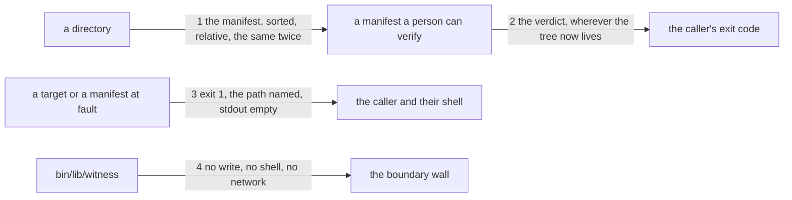

# Drawing: witness-a-tree

_Written in architect mode from `requirements/witness-a-tree`, four
criteria and four red tests. The closed requirements that touch these
paths were read first, and one of them fixes a shape I may not change:
assess-boundary's unit tests compare a boundary finding as
`${f.file} ${f.verb}`, with `file` the bare name, so the wall's finding
keeps that shape and gains a field rather than being rewritten. security-v1
and the reach rule fix that a module reaching the shell or the network is
declared; this one reaches neither. code-v2 fixes that a listing which
finds nothing still answers, which is why an empty tree prints nothing and
exits 0 rather than complaining. The human approves by merge._

## Structure

What exists: `bin/kaal.mjs`, whose branches hand a path to a module in
`bin/lib/`; `bin/lib/sha.mjs`, which hashes a file; `bin/lib/boundary.mjs`,
the wall that reads `bin/lib/assess/` and forbids a write, a shell call or
a network call there.

What is new:

- **`bin/lib/witness/manifest.mjs`**: the format. It walks a directory and
  renders the lines, and it reads lines back into pairs. One module owns
  both directions, so a manifest this repository writes is a manifest it
  can read.
- **`bin/lib/witness/compare.mjs`**: the verdict. Given a directory and a
  manifest's text, it returns one finding per path that was added, removed
  or changed, and nothing when they agree.

What changes:

- **`bin/lib/boundary.mjs`**: from one guarded directory to a list of
  guarded places, each with an optional sink. `bin/lib/witness` joins
  `bin/lib/assess`, with no sink at all, because the witness never writes.
  A finding gains the place it was found in and keeps its `file`.
- **`bin/kaal.mjs`**: one branch, the usage line, and a boundary line that
  names the guarded places rather than the assess tree alone.
- **`README.md`**: one sentence on what the command answers.

## Seams

1. **the manifest, sorted, relative, the same twice**: in, a directory;
   out, a line per file, `<sha256><two spaces><path>`, ascending by path,
   `/` on every platform, and byte for byte the same on a second run. The
   contract writes a tree whose files are created in reverse order and in
   nested directories, so filesystem order and sorted order differ, and
   runs it twice. Owned by the walker on one side, anything that reads a
   manifest on the other.
2. **the verdict, wherever the tree now lives**: in, a directory and a
   manifest's text; out, exit 0 and one line saying nothing moved, or exit
   1 and one line per path with which of added, removed or changed it was.
   The contract takes a manifest of one tree and runs it against a copy of
   that tree at another path, because the promise is about contents and
   relative paths and not about where the tree sits: a guest harness copies
   a fixture before it points a skill at it.
3. **exit 1, the path named, stdout empty**: in, a target that is not a
   directory, a manifest that is missing, or a manifest with a line that is
   not a line; out, exit 1, one line on stderr naming the path at fault,
   and nothing on stdout. The contract holds the third case in particular:
   a manifest with one good line and one bad one is a fault, never a
   verdict on the half that parsed.
4. **no write, no shell, no network**: in, the modules under
   `bin/lib/witness`; out, a `boundary` finding for any of the three. The
   contract drives `kaal boundary` on a fixture root whose witness writes,
   and reads the finding. Owned by the wall on one side, every future edit
   to the witness on the other.

## Fixed and free

- Fixed: the manifest line, its order, its separator; that a second run is
  identical; the exit codes 0 and 1; `nothing moved` on stdout for
  agreement and one line per moved path carrying the path and one of the
  three words; that a fault writes one line on stderr naming the path and
  nothing on stdout; that `witness` stays out of the applicability table;
  and that a boundary finding keeps `file` as the bare name, because
  assess-boundary's unit tests read it and that task is closed.
- Free: the word order inside a moved line; how the modules split the work
  behind `bin/lib/witness/`; whether the walk recurses or keeps a stack;
  how a manifest line is parsed; the wording of the boundary's green line.

## Decisions

### The witness lives in a guarded place, not in a file the wall excuses

- Chosen: `bin/lib/witness/`, a directory the boundary wall guards, with no
  sink: nothing in it may write.
- Not taken: a single `bin/lib/witness.mjs` and a wall taught to guard
  files as well as directories; no wall at all, trusting the acceptance
  test that the running command wrote nothing.
- Because: a tool whose entire value is the sentence "it did not touch your
  tree" should be structurally unable to write, not observed not to. The
  acceptance test proves today's behaviour; the wall refuses tomorrow's
  edit. Teaching the wall about files as well as directories is a second
  shape for no gain, since a place is what a wall guards well.
- Reopens if: the witness ever needs to write a manifest itself, which this
  requirement forbids; then it needs a sink and the assess shape returns.

### The wall's finding keeps its shape and gains a field

- Chosen: `{ file, verb }` stays, with `file` the bare name; a `where` says
  which guarded place it came from, and the command line prints both.
- Not taken: making `file` the path relative to the root, which reads
  better once two places are guarded.
- Because: assess-boundary is closed and its unit tests compare
  `${f.file} ${f.verb}` exactly. Consistency bought by breaking a closed
  task is not consistency, it is a rewrite, and this repository has decided
  that once already.
- Reopens if: assess-boundary is superseded, which is when the shape is
  free again.

### The manifest is the shape `sha256sum` prints, not JSON

- Chosen: text lines, `<sha256><two spaces><path>`.
- Not taken: a JSON document like `kaal.target/v1`, which the assessor
  emits.
- Because: a manifest is evidence a person keeps and compares, sometimes
  months later, and a shape a standard tool can verify is evidence that
  does not depend on us. It also diffs like text, which is what a person
  does with it when the verdict says something moved. The verdict is the
  machine's half, and it is a line per finding like every other wall here.
- Reopens if: the guest harness wants a `--json` verdict, the requirement's
  fourth open question; that adds a form to the verdict and leaves the
  manifest alone.

### A mode change with equal bytes is not a move

- Chosen: the manifest carries bytes and a path, and nothing else; a file
  whose contents are identical and whose mode changed is not reported.
- Not taken: a mode column, which would end the `sha256sum` compatibility;
  a second section reporting mode changes separately.
- Because: the requirement asked this as an open question and it is the
  architect's to close. The case it would catch is a guest that
  deliberately chmods a file it did not otherwise touch, which is rarer
  than the cost of a manifest no standard tool can read.
- Reopens if: a guest is ever caught leaving an executable bit behind, or
  a fixture tree needs its modes preserved to mean anything.

## Test strategy

| criterion | layer        | kind          | why                                                       |
| --------- | ------------ | ------------- | --------------------------------------------------------- |
| 1         | contract 1   | deterministic | sorted against filesystem order, and identical twice      |
| 2         | contract 2   | deterministic | the same tree at another path still agrees                |
| 3         | contract 4   | deterministic | the wall refuses a write that is not there yet            |
| 3         | acceptance 3 | deterministic | the tree read back after both forms, the failing included |
| 4         | contract 3   | deterministic | a half parsable manifest is a fault, not a half verdict   |

## Handoff

- Task: witness-a-tree
- Seams: 4; contract tests: 4 (equal), beside this file; fixture root
  `fixtures/leaky-witness/` here, trees built in a temporary directory by
  the tests
- Red run:
  `node --test --test-timeout=60000 architecture/witness-a-tree/contracts.test.mjs`;
  all four red. Stand-in green: all four, on a throwaway `bin/lib/witness/`
  and a boundary list of two places, discarded
- Criteria served: seam 1 serves 1; seam 2 serves 2; seam 3 serves 4; seam
  4 serves 3
- Fixed for the developer: the manifest line and its order, the two exit
  codes, the stdout and stderr split, the guarded directory with no sink,
  and that a boundary finding keeps `file` as the bare name
- Next: the human approves by merge; then `code`
