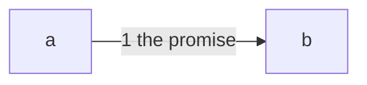

# Drawing: says-none

## What the runs said

- A fixture: a drawing whose decision cites a principle this tree does not hold.

## Structure

- One part, which is this file.

## Seams

1. **The promise.** A fixture seam.

## Fixed and free

Fixed: the fixture's shape. Free: nothing.

## Decisions

### The choice this fixture records

- Chosen: the fixture
- Not taken: no fixture
- Because: a wall that reads a citation needs one that resolves to nothing.
- Bought: the shortest path to value; spent nothing, which makes it a detail.
- Weighed against: none
- Reopens if: the wall stops reading citations.

## Test strategy

| criterion | layer    | kind | why       |
| --------- | -------- | ---- | --------- |
| 1         | contract | none | a fixture |

## Handoff

- Task: says-none
- Seams: 1; contract tests: 1 (equal)
