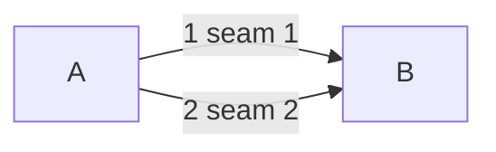

# Drawing: t

## Structure

Parts.

## Seams

1. first: in, out, owned.
2. second: in, out, owned.

## Fixed and free

- Fixed: the formats.
- Free: the rest.

## Decisions

### One

- Chosen: this
- Not taken: that
- Because: reasons
- Reopens if: never

## Test strategy

| criterion | layer    | kind          | why |
| --------- | -------- | ------------- | --- |
| 1         | contract | deterministic | why |

## Handoff

- Task: t
