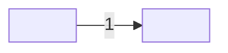

# Drawing: <task>

## Structure

<The parts and how they sit: what exists, what is new, what changes. Each
named by what it is for.>

## Seams



One labelled edge per seam, numbered to match the list below; the parts are
the structure's parts. The list is the contract; the picture is the reading,
and it carries nothing the list does not.

1. <name>: in <what goes in>, out <what comes out>, owned by <side / side>.
2. <...>

## Fixed and free

- Fixed: <what the developer may not change, and which criterion or
  constraint fixes it>
- Free: <what is the developer's to decide>

## Decisions

### <decision>

- Chosen: <the choice>
- Not taken: <option>, <option>
- Because: <one paragraph>
- Reopens if: <the condition>

## Test strategy

| criterion | layer    | kind                               | why  |
| --------- | -------- | ---------------------------------- | ---- |
| 1         | contract | deterministic / harnessed / manual | <..> |

## Handoff

- Task: <task>
- Seams: <n>; contract tests: <n> (equal)
- Red run: <runner, all failing>; stand-in green: <all passing, discarded>
- Criteria served: <seam -> criteria>
- Fixed for the developer: <list>

---

# Contract test shape (manual)

```
Test <n> (manual): seam <n>, <the promise restated>
Steps:
  1. <drive one side of the seam>
Expected: <what the other side must show>
```
